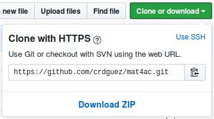

# Matemáticas 4ºESO Académicas

Documentación generada mientras se daba un curso de 4ºESO de Matemáticas Académicas

## Descargar los recursos

Lo más sencillo es descargar a tu ordenador el repositorio en formato zip mediante la opción que aparece en la esquina superior izquierda del repositorio -**Clone or Download --> Download Zip**-. 

No obstante se recomienda usar *git* en local. Se recomienda empezar con esta [guía sencilla de git](http://rogerdudler.github.io/git-guide/index.es.html)

## Editando los documentos LaTeX

Muchos documentos están creados en LaTeX. Aunque en el repositorio también aparecen los documentos *pdf* generados al compilar los ficheros *tex* puede que te interese modificarlos documentos y adaptarlos a tus necesidades. Un editor "relativamente sencillo" y En recomendable es [texmaker](http://www.xm1math.net/texmaker/). En su web tienes acceso a su [documentación](http://www.xm1math.net/texmaker/doc.html)   

### Personalizar las imágenes de los encabezados de los documentos latex

Por defecto aparecen los iconos del instituto (IES Pedro Cerrada) y de la comunidad en la que uno de los autores trabaja (Aragón).

