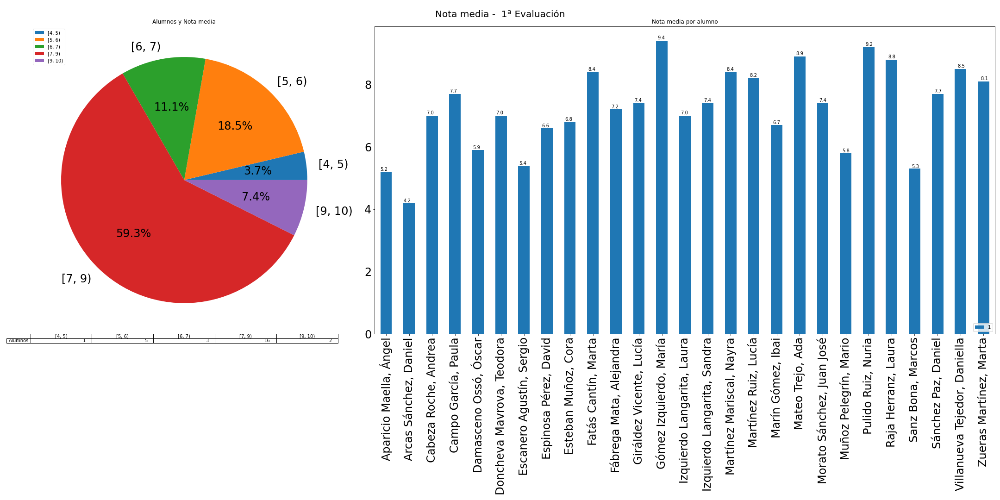

---
title: "Acta de la 1ª evaluación" 
author: IES Pedro Cerrada
date: 4ºESO B
titlepage: true
logo: headerright
geometry: landscape,margin=1in
keywords: [Acta]
... 
# Acta de la 1ª evaluación 

 \newpage 

## Resultados generales: 
A nivel de grupo, se tienen los siguientes datos: 
 
* **nota media**: 7.24 
* **número de suspensos**: 28 
* **número de suspensos por alumno**: 1.04 
  
 El número de alumnos por suspensos se distribuyen de la siguiente manera: 

* **0 susp.**: 15 
* **1 susp.**: 7 
* **2 susp.**: 1 
* **3 ó 4 susp.**: 2 
* **> 4 susp.**: 2 
  
 
 
 Gráficamente: 
 
  
 
 
 Alumnos con suspensos: 

* Con **6** asignaturas: 

    - Arcas Sánchez, Daniel (GH 4º, IN 4º, CCL 4º, FQ 4º, LE 4º, MC 4º) 
 

* Con **5** asignaturas: 

    - Escanero Agustín, Sergio (BG 4º, TIC 4º, GHB 4º, MC 4º, LE 4º) 
 

* Con **4** asignaturas: 

    - Aparicio Maella, Ángel (LE 4º, TC 4º, TIC 4º, FQ 4º) 
 

    - Sanz Bona, Marcos (BG 4º, FQ 4º, MC 4º, LE 4º) 
 

* Con **2** asignaturas: 

    - Doncheva Mavrova, Teodora (GHB 4º, MC 4º) 
 

* Con **1** asignaturas: 

    - Cabeza Roche, Andrea (GHB 4º) 
 

    - Damasceno Ossó, Óscar (TIC 4º) 
 

    - Giráldez Vicente, Lucía (TIC 4º) 
 

    - Izquierdo Langarita, Laura (MC 4º) 
 

    - Izquierdo Langarita, Sandra (MC 4º) 
 

    - Morato Sánchez, Juan José (MC 4º) 
 

    - Muñoz Pelegrín, Mario (MC 4º) 
 
El número de alumnos por nota media se distribuye de la siguiente manera: 

* **[0, 3)**: 0 
* **[3, 4)**: 0 
* **[4, 5)**: 1 
* **[5, 6)**: 5 
* **[6, 7)**: 3 
* **[7, 9)**: 16 
* **[9, 10)**: 2 
  
 

 Gráficamente 
 
  
 

## Resultados por alumno 

### Aparicio Maella, Ángel 

 * **Nota media**: 5.2, **Número de suspensos**: 4 
  
 

* Suspensos: LE 4º, TC 4º, TIC 4º, FQ 4º 

 * Resultados: **EC 4º**: 5, **EF 4º**: 6, **FQ 4º**: 4, **GH 4º**: 5, **IN 4º**: 6, **LE 4º**: 4, **MC 4º**: 5, **TC 4º**: 4, **TIC 4º**: 4, **VET 4º**: 9 
  
 

 * Observaciones: Alumno poco trabajador, y además justo. No se tiene que descuidar

### Arcas Sánchez, Daniel 

 * **Nota media**: 4.2, **Número de suspensos**: 6 
  
 

* Suspensos: GH 4º, IN 4º, CCL 4º, FQ 4º, LE 4º, MC 4º 

 * Resultados: **CCL 4º**: 4, **EC 4º**: 5, **EF 4º**: 7, **FQ 4º**: 3, **GH 4º**: 2, **IN 4º**: 3, **LE 4º**: 3, **MC 4º**: 2, **TC 4º**: 5, **VET 4º**: 8 
  
 

 * Observaciones: Alumno con muchas dificultades que ha rechazado derivaciones en otras ocasiones.  En el grupo e itinerario actual lo tiene muy complicado

### Cabeza Roche, Andrea 

 * **Nota media**: 7, **Número de suspensos**: 1 
  
 

* Suspensos: GHB 4º 

 * Resultados: **ARE 4º**: 8, **BG 4º**: 9, **EF 4º**: 8, **FQB 4º**: 6, **FR2 4º**: 7, **GHB 4º**: 4, **INB 4º**: 7, **LE 4º**: 7, **MC 4º**: 6, **VET 4º**: 8 
  
 

 * Observaciones: Si mejora el trabajo en casa, posiblemente mejore los resultados. Se ha dejado tareas para casa sin entregar (LE, MA, GHB)

### Campo García, Paula 

 * **Nota media**: 7.7, **Número de suspensos**: 0 
  
 

 * Resultados: **ARE 4º**: 8, **BG 4º**: 7, **EF 4º**: 8, **FQB 4º**: 8, **FR2 4º**: 8, **GHB 4º**: 8, **INB 4º**: 8, **LE 4º**: 8, **MC 4º**: 6, **VET 4º**: 8 
  
 

 * Observaciones: Bastante trabajadora. En algunas asignaturas participa menos (MA, FQ) sin embargo en otras está más activa (ARE, Fr)

### Damasceno Ossó, Óscar 

 * **Nota media**: 5.9, **Número de suspensos**: 1 
  
 

* Suspensos: TIC 4º 

 * Resultados: **EC 4º**: 8, **EF 4º**: 5, **FQ 4º**: 6, **GH 4º**: 6, **IN 4º**: 6, **LE 4º**: 6, **MC 4º**: 5, **PL 4º**: 7, **RC 4º**: 6, **TIC 4º**: 4 
  
 

 * Observaciones: Ha trabajado más o menos bien, pero no se puede descuidar con las notas que tiene

### Doncheva Mavrova, Teodora 

 * **Nota media**: 7, **Número de suspensos**: 2 
  
 

* Suspensos: GHB 4º, MC 4º 

 * Resultados: **BG 4º**: 7, **CC 4º**: 8, **EF 4º**: 7, **FQB 4º**: 8, **GHB 4º**: 4, **INB 4º**: 9, **LE 4º**: 6, **MC 4º**: 4, **MU 4º**: 9, **VET 4º**: 8 
  
 

 * Observaciones: Falta de trabajo sobre todo en casa. Debe cuidar este aspecto para llevar el curso al día, ya que es capaz

### Escanero Agustín, Sergio 

 * **Nota media**: 5.4, **Número de suspensos**: 5 
  
 

* Suspensos: BG 4º, TIC 4º, GHB 4º, MC 4º, LE 4º 

 * Resultados: **BG 4º**: 4, **EF 4º**: 7, **FQB 4º**: 6, **GHB 4º**: 4, **INB 4º**: 6, **LE 4º**: 4, **MC 4º**: 4, **MU 4º**: 8, **RC 4º**: 8, **TIC 4º**: 3 
  
 

 * Observaciones: Tiene que trabajar más si no quiere tener problemas a final de curso

### Espinosa Pérez, David 

 * **Nota media**: 6.6, **Número de suspensos**: 0 
  
 

 * Resultados: **ECB 4º**: 9, **EF 4º**: 8, **FQ 4º**: 5, **GHB 4º**: 5, **INB 4º**: 7, **LE 4º**: 5, **MC 4º**: 5, **TC 4º**: 7, **TIC 4º**: 7, **VET 4º**: 8 
  
 

 * Observaciones: Alumno capaz, pero con falta de trabajo. Piensa que con atender es suficiente, necesita trabajar más para consolidar el conocimiento.

### Esteban Muñoz, Cora 

 * **Nota media**: 6.8, **Número de suspensos**: 0 
  
 

 * Resultados: **ECB 4º**: 6, **EF 4º**: 6, **FQ 4º**: 7, **GHB 4º**: 7, **INB 4º**: 8, **LE 4º**: 7, **MC 4º**: 5, **TC 4º**: 7, **TIC 4º**: 7, **VET 4º**: 8 
  
 

 * Observaciones: Buena actitud y trabajo. Parece que va ganando en confianza

### Fatás Cantín, Marta 

 * **Nota media**: 8.4, **Número de suspensos**: 0 
  
 

 * Resultados: **BG 4º**: 9, **EF 4º**: 9, **FQB 4º**: 8, **FR2 4º**: 9, **GHB 4º**: 8, **INB 4º**: 8, **LE 4º**: 8, **MC 4º**: 8, **RC 4º**: 8, **TIC 4º**: 9 
  
 

 * Observaciones: Alumna participativa. En ocasiones tiene altibajos en su rendimiento (MC, FQ)

### Fábrega Mata, Alejandra 

 * **Nota media**: 7.2, **Número de suspensos**: 0 
  
 

 * Resultados: **BG 4º**: 7, **EF 4º**: 8, **FQB 4º**: 7, **GHB 4º**: 7, **INB 4º**: 8, **LE 4º**: 7, **MC 4º**: 5, **RC 4º**: 8, **TC 4º**: 8, **TIC 4º**: 7 
  
 

 * Observaciones: Bien. Aunque empezó algo perdida al final ha mejorado

### Giráldez Vicente, Lucía 

 * **Nota media**: 7.4, **Número de suspensos**: 1 
  
 

* Suspensos: TIC 4º 

 * Resultados: **BG 4º**: 7, **EF 4º**: 8, **FQB 4º**: 8, **FR2 4º**: 9, **GHB 4º**: 9, **INB 4º**: 7, **LE 4º**: 7, **MC 4º**: 6, **RC 4º**: 9, **TIC 4º**: 4 
  
 

 * Observaciones: Muy participativa y trabajadora. Por lo visto, está bastante más centrada que otros cursos

### Gómez Izquierdo, María 

 * **Nota media**: 9.4, **Número de suspensos**: 0 
  
 

 * Resultados: **BG 4º**: 10, **EF 4º**: 9, **FIL 4º**: 10, **FQB 4º**: 10, **FR2 4º**: 9, **GHB 4º**: 10, **INB 4º**: 9, **LE 4º**: 9, **MC 4º**: 9, **RC 4º**: 9 
  
 

 * Observaciones: Muy bien. Por poner un "pero" que sea más participativa

### Izquierdo Langarita, Laura 

 * **Nota media**: 7, **Número de suspensos**: 1 
  
 

* Suspensos: MC 4º 

 * Resultados: **BG 4º**: 7, **CC 4º**: 9, **EF 4º**: 6, **FQB 4º**: 7, **FR2 4º**: 7, **GHB 4º**: 8, **INB 4º**: 8, **LE 4º**: 7, **MC 4º**: 4, **RC 4º**: 7 
  
 

 * Observaciones: Bien, trabajadora. Ciertas dificultades con MC y FQ

### Izquierdo Langarita, Sandra 

 * **Nota media**: 7.4, **Número de suspensos**: 1 
  
 

* Suspensos: MC 4º 

 * Resultados: **BG 4º**: 7, **CC 4º**: 9, **EF 4º**: 9, **FQB 4º**: 7, **FR2 4º**: 8, **GHB 4º**: 7, **INB 4º**: 8, **LE 4º**: 7, **MC 4º**: 4, **RC 4º**: 8 
  
 

 * Observaciones: Bien, trabajadora. Ciertas dificultades con MC y FQ

### Martínez Mariscal, Nayra 

 * **Nota media**: 8.4, **Número de suspensos**: 0 
  
 

 * Resultados: **BG 4º**: 8, **EF 4º**: 9, **FQB 4º**: 9, **FR2 4º**: 9, **GHB 4º**: 8, **INB 4º**: 7, **LE 4º**: 9, **MC 4º**: 8, **TIC 4º**: 8, **VET 4º**: 9 
  
 

 * Observaciones: Buena actitud y trabajadora

### Martínez Ruiz, Lucía 

 * **Nota media**: 8.2, **Número de suspensos**: 0 
  
 

 * Resultados: **ECB 4º**: 9, **EF 4º**: 9, **FQ 4º**: 7, **GHB 4º**: 6, **INB 4º**: 8, **LE 4º**: 9, **MC 4º**: 6, **TC 4º**: 10, **TIC 4º**: 9, **VET 4º**: 9 
  
 

 * Observaciones: Muy buena actitud y trabajadora

### Marín Gómez, Ibai 

 * **Nota media**: 6.7, **Número de suspensos**: 0 
  
 

 * Resultados: **EC 4º**: 7, **EF 4º**: 6, **FIL 4º**: 6, **FQ 4º**: 5, **GH 4º**: 7, **IN 4º**: 6, **LE 4º**: 7, **MC 4º**: 8, **MU 4º**: 8, **RC 4º**: 7 
  
 

 * Observaciones: Buena actitud y trabajo en general

### Mateo Trejo, Ada 

 * **Nota media**: 8.9, **Número de suspensos**: 0 
  
 

 * Resultados: **BG 4º**: 9, **EF 4º**: 9, **FQB 4º**: 9, **GHB 4º**: 10, **INB 4º**: 9, **LE 4º**: 9, **MC 4º**: 8, **TC 4º**: 8, **TIC 4º**: 10, **VET 4º**: 8 
  
 

 * Observaciones: Muy buen trabajo y actitud

### Morato Sánchez, Juan José 

 * **Nota media**: 7.4, **Número de suspensos**: 1 
  
 

* Suspensos: MC 4º 

 * Resultados: **ECB 4º**: 9, **EF 4º**: 9, **FQ 4º**: 7, **FR2 4º**: 7, **GHB 4º**: 7, **INB 4º**: 9, **LE 4º**: 6, **MC 4º**: 4, **TIC 4º**: 9, **VET 4º**: 7 
  
 

 * Observaciones: En algunas asignaturas (EC) es muy participativo, en otras pasa más desapercibido. A veces es desordenado y caótico

### Muñoz Pelegrín, Mario 

 * **Nota media**: 5.8, **Número de suspensos**: 1 
  
 

* Suspensos: MC 4º 

 * Resultados: **EC 4º**: 7, **EF 4º**: 6, **FQ 4º**: 5, **GH 4º**: 5, **IN 4º**: 5, **LE 4º**: 6, **MC 4º**: 4, **RC 4º**: 7, **TC 4º**: 6, **TIC 4º**: 7 
  
 

 * Observaciones: Ha mejorado al final del trimestre. Tiene que organizarse mejor, sobre todo con el trabajo de casa

### Pulido Ruiz, Nuria 

 * **Nota media**: 9.2, **Número de suspensos**: 0 
  
 

 * Resultados: **ARE 4º**: 8, **ECB 4º**: 9, **EF 4º**: 9, **FQ 4º**: 9, **FR2 4º**: 10, **GHB 4º**: 10, **INB 4º**: 9, **LE 4º**: 10, **MC 4º**: 10, **RC 4º**: 8 
  
 

 * Observaciones: Muy bien.

### Raja Herranz, Laura 

 * **Nota media**: 8.8, **Número de suspensos**: 0 
  
 

 * Resultados: **ARE 4º**: 8, **BG 4º**: 9, **EF 4º**: 9, **FQB 4º**: 10, **FR2 4º**: 9, **GHB 4º**: 9, **INB 4º**: 9, **LE 4º**: 9, **MC 4º**: 8, **VET 4º**: 8 
  
 

 * Observaciones: Muy bien, aunque a veces es demasiado exigente con ella misma. Debe aprender a gestionar esa presión

### Sanz Bona, Marcos 

 * **Nota media**: 5.3, **Número de suspensos**: 4 
  
 

* Suspensos: BG 4º, FQ 4º, MC 4º, LE 4º 

 * Resultados: **BG 4º**: 4, **CC 4º**: 7, **EF 4º**: 7, **FQ 4º**: 4, **GH 4º**: 6, **IN 4º**: 8, **LE 4º**: 4, **MC 4º**: 2, **RC 4º**: 6, **TC 4º**: 5 
  
 

 * Observaciones: Pese a los malos resultados, parece que esta mejor que el año pasado. No obstante, todavía tiene que mejorar bastante si no quiere tener problemas.

### Sánchez Paz, Daniel 

 * **Nota media**: 7.7, **Número de suspensos**: 0 
  
 

 * Resultados: **EC 4º**: 9, **EF 4º**: 6, **FQ 4º**: 6, **GH 4º**: 8, **IN 4º**: 7, **LE 4º**: 8, **MC 4º**: 9, **RC 4º**: 7, **TC 4º**: 9, **TIC 4º**: 8 
  
 

 * Observaciones: Muy buena actitud y trabajo

### Villanueva Tejedor, Daniella 

 * **Nota media**: 8.5, **Número de suspensos**: 0 
  
 

 * Resultados: **BG 4º**: 8, **EF 4º**: 9, **FQB 4º**: 9, **GHB 4º**: 8, **INB 4º**: 9, **LE 4º**: 8, **MC 4º**: 6, **PL 4º**: 10, **TIC 4º**: 9, **VET 4º**: 9 
  
 

 * Observaciones: Buena actitud y trabajo, a veces va un poco a remolque. La situación familiar que ha pasado tampoco le ha ayudado mucho.

### Zueras Martínez, Marta 

 * **Nota media**: 8.1, **Número de suspensos**: 0 
  
 

 * Resultados: **ARE 4º**: 8, **BG 4º**: 8, **EF 4º**: 9, **FQB 4º**: 8, **FR2 4º**: 9, **GHB 4º**: 8, **INB 4º**: 8, **LE 4º**: 9, **MC 4º**: 6, **VET 4º**: 8 
  
 

 * Observaciones: Buena actitud y trabajo en general