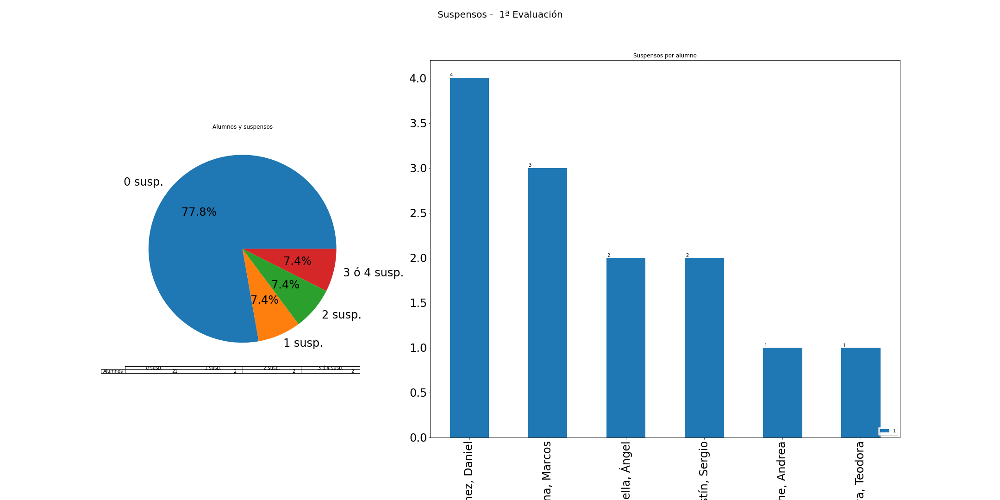
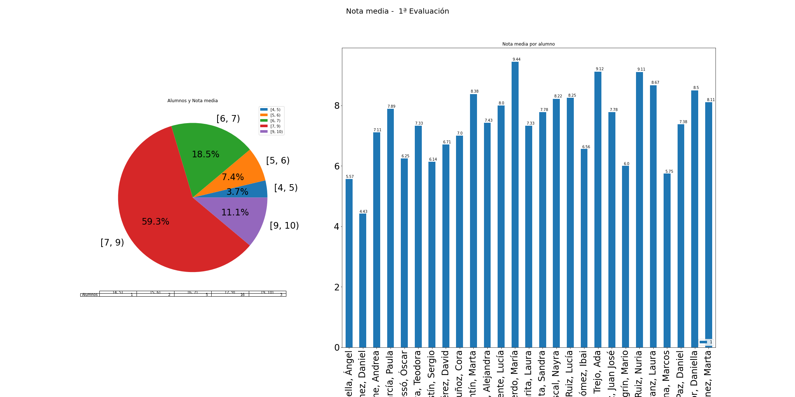

---
title: "Acta de la 1ª evaluación" 
author: IES Pedro Cerrada
date: 4ºESO B
titlepage: true
logo: headerright
geometry: landscape,margin=1in
keywords: [Acta]
... 
# Acta de la 1ª evaluación 

 \newpage 

## Resultados generales: 
A nivel de grupo, se tienen los siguientes datos: 
 
* **nota media**: 5.79 
* **número de suspensos**: 208 
* **número de suspensos por alumno**: 7.7 
  
 El número de alumnos por suspensos se distribuyen de la siguiente manera: 

* **0 susp.**: 0 
* **1 susp.**: 0 
* **2 susp.**: 1 
* **3 ó 4 susp.**: 0 
* **> 4 susp.**: 21 
  
 
 
 Gráficamente: 
 
  
 
 
 Alumnos con suspensos: 

* Con **13** asignaturas: 

    - Martínez Ruiz, Lucía (CC, ECB, EF, FIL, FQ, IN, INB, MC, MU, PL, RC, TIC, VET) 
 

* Con **11** asignaturas: 

    - Damasceno Ossó, Óscar (CCL, ECB, FQ, FQB, FR2, GHB, IN, LE, MC, MU, VET) 
 

    - Doncheva Mavrova, Teodora (ARE, CC, CCL, EF, FIL, FR2, GHB, INB, RC, TC, TIC) 
 

* Con **10** asignaturas: 

    - Muñoz Pelegrín, Mario (ARE, CC, CCL, EC, EF, GH, IN, RC, TC, TIC) 
 

    - Villanueva Tejedor, Daniella (CC, CCL, FQB, FR2, GH, GHB, IN, LE, PL, TC) 
 

* Con **9** asignaturas: 

    - Aparicio Maella, Ángel (CC, CCL, EC, FIL, FR2, GH, INB, MC, MU) 
 

    - Cabeza Roche, Andrea (CC, EC, ECB, GHB, LE, MC, MU, PL, VET) 
 

    - Pulido Ruiz, Nuria (EC, ECB, EF, FIL, FR2, GHB, IN, PL, TC) 
 

    - Zueras Martínez, Marta (ARE, CC, FIL, FQ, GHB, IN, LE, TC, TIC) 
 

* Con **8** asignaturas: 

    - Escanero Agustín, Sergio (ECB, FQB, FR2, GH, MU, RC, TC, TIC) 
 

    - Espinosa Pérez, David (CC, EC, EF, FQ, FR2, GH, GHB, LE) 
 

    - Fatás Cantín, Marta (CCL, FQ, FQB, GH, GHB, LE, MU, RC) 
 

    - Fábrega Mata, Alejandra (FIL, FR2, IN, INB, LE, MU, TC, VET) 
 

    - Giráldez Vicente, Lucía (EF, FIL, FQ, FQB, GHB, INB, LE, TC) 
 

    - Izquierdo Langarita, Laura (ARE, CC, EC, FQ, GHB, INB, MC, RC) 
 

    - Izquierdo Langarita, Sandra (ARE, FQ, GHB, LE, MU, TC, TIC, VET) 
 

    - Martínez Mariscal, Nayra (CC, EC, FR2, IN, INB, LE, MU, RC) 
 

* Con **7** asignaturas: 

    - Campo García, Paula (CC, EF, FR2, GH, GHB, RC, TIC) 
 

* Con **6** asignaturas: 

    - Esteban Muñoz, Cora (CCL, EC, INB, MU, TC, VET) 
 

    - Mateo Trejo, Ada (CC, EC, GH, LE, PL, RC) 
 

    - Morato Sánchez, Juan José (CCL, ECB, FQ, INB, TC, TIC) 
 

    - Sanz Bona, Marcos (ARE, BG, FQB, GHB, IN, RC) 
 

* Con **5** asignaturas: 

    - Arcas Sánchez, Daniel (CCL, EF, FR2, IN, MU) 
 

    - Gómez Izquierdo, María (ARE, CCL, MC, PL, TC) 
 

    - Marín Gómez, Ibai (FQ, FQB, INB, RC, VET) 
 

    - Raja Herranz, Laura (FQB, IN, INB, LE, MU) 
 

* Con **2** asignaturas: 

    - Sánchez Paz, Daniel (ECB, FQB) 
 
El número de alumnos por nota media se distribuye de la siguiente manera: 

* **[0, 3)**: 0 
* **[3, 4)**: 0 
* **[4, 5)**: 3 
* **[5, 6)**: 13 
* **[6, 7)**: 10 
* **[7, 9)**: 1 
* **[9, 10)**: 0 
  
 

 Gráficamente 
 
  
 

## Resultados por alumno 

### Aparicio Maella, Ángel 

 * **Nota media**: 5.09, **Número de suspensos**: 9 
  
 

* Suspensos: CC, CCL, EC, FIL, FR2, GH, INB, MC, MU 

|   Eval |   ARE |   CC |   CCL |   EC |   ECB |   EF |   FIL |   FQ |   FQB |   FR2 |   GH |   GHB |   IN |   INB |   LE |   MC |   MU |   PL |   RC |   TC |   TIC |   VET |
|:------:|:-----:|:----:|:-----:|:----:|:-----:|:----:|:-----:|:----:|:-----:|:-----:|:----:|:-----:|:----:|:-----:|:----:|:----:|:----:|:----:|:----:|:----:|:-----:|:-----:|
|      1 |     8 |    4 |     3 |    1 |     6 |    8 |     2 |   10 |     5 |     1 |    1 |    10 |    5 |     1 |    8 |    3 |    1 |    6 |    8 |    9 |     6 |     6 |

 * En concreto: **ARE**: 8, **CC**: 4, **CCL**: 3, **EC**: 1, **ECB**: 6, **EF**: 8, **FIL**: 2, **FQ**: 10, **FQB**: 5, **FR2**: 1, **GH**: 1, **GHB**: 10, **IN**: 5, **INB**: 1, **LE**: 8, **MC**: 3, **MU**: 1, **PL**: 6, **RC**: 8, **TC**: 9, **TIC**: 6, **VET**: 6 
  
 

### Arcas Sánchez, Daniel 

 * **Nota media**: 6.09, **Número de suspensos**: 5 
  
 

* Suspensos: CCL, EF, FR2, IN, MU 

|   Eval |   ARE |   CC |   CCL |   EC |   ECB |   EF |   FIL |   FQ |   FQB |   FR2 |   GH |   GHB |   IN |   INB |   LE |   MC |   MU |   PL |   RC |   TC |   TIC |   VET |
|:------:|:-----:|:----:|:-----:|:----:|:-----:|:----:|:-----:|:----:|:-----:|:-----:|:----:|:-----:|:----:|:-----:|:----:|:----:|:----:|:----:|:----:|:----:|:-----:|:-----:|
|      1 |     8 |    7 |     2 |    5 |     8 |    4 |     7 |   10 |     6 |     3 |    9 |     8 |    3 |     5 |    5 |    6 |    4 |    6 |    5 |    9 |     7 |     7 |

 * En concreto: **ARE**: 8, **CC**: 7, **CCL**: 2, **EC**: 5, **ECB**: 8, **EF**: 4, **FIL**: 7, **FQ**: 10, **FQB**: 6, **FR2**: 3, **GH**: 9, **GHB**: 8, **IN**: 3, **INB**: 5, **LE**: 5, **MC**: 6, **MU**: 4, **PL**: 6, **RC**: 5, **TC**: 9, **TIC**: 7, **VET**: 7 
  
 

### Cabeza Roche, Andrea 

 * **Nota media**: 6, **Número de suspensos**: 9 
  
 

* Suspensos: CC, EC, ECB, GHB, LE, MC, MU, PL, VET 

|   Eval |   ARE |   BG |   CC |   CCL |   EC |   ECB |   EF |   FIL |   FQ |   FQB |   FR2 |   GH |   GHB |   IN |   INB |   LE |   MC |   MU |   PL |   RC |   TC |   TIC |   VET |
|:------:|:-----:|:----:|:----:|:-----:|:----:|:-----:|:----:|:-----:|:----:|:-----:|:-----:|:----:|:-----:|:----:|:-----:|:----:|:----:|:----:|:----:|:----:|:----:|:-----:|:-----:|
|      1 |     9 |    9 |    2 |     9 |    3 |     4 |   10 |     5 |    7 |     5 |    10 |    9 |     4 |    5 |     7 |    3 |    4 |    1 |    3 |   10 |    7 |    10 |     2 |

 * En concreto: **ARE**: 9, **BG**: 9, **CC**: 2, **CCL**: 9, **EC**: 3, **ECB**: 4, **EF**: 10, **FIL**: 5, **FQ**: 7, **FQB**: 5, **FR2**: 10, **GH**: 9, **GHB**: 4, **IN**: 5, **INB**: 7, **LE**: 3, **MC**: 4, **MU**: 1, **PL**: 3, **RC**: 10, **TC**: 7, **TIC**: 10, **VET**: 2 
  
 

### Campo García, Paula 

 * **Nota media**: 6.3, **Número de suspensos**: 7 
  
 

* Suspensos: CC, EF, FR2, GH, GHB, RC, TIC 

|   Eval |   ARE |   BG |   CC |   CCL |   EC |   ECB |   EF |   FIL |   FQ |   FQB |   FR2 |   GH |   GHB |   IN |   INB |   LE |   MC |   MU |   PL |   RC |   TC |   TIC |   VET |
|:------:|:-----:|:----:|:----:|:-----:|:----:|:-----:|:----:|:-----:|:----:|:-----:|:-----:|:----:|:-----:|:----:|:-----:|:----:|:----:|:----:|:----:|:----:|:----:|:-----:|:-----:|
|      1 |    10 |    7 |    4 |    10 |    6 |     5 |    4 |     9 |    8 |     8 |     3 |    4 |     1 |    6 |     6 |    8 |    7 |    9 |   10 |    4 |    7 |     2 |     7 |

 * En concreto: **ARE**: 10, **BG**: 7, **CC**: 4, **CCL**: 10, **EC**: 6, **ECB**: 5, **EF**: 4, **FIL**: 9, **FQ**: 8, **FQB**: 8, **FR2**: 3, **GH**: 4, **GHB**: 1, **IN**: 6, **INB**: 6, **LE**: 8, **MC**: 7, **MU**: 9, **PL**: 10, **RC**: 4, **TC**: 7, **TIC**: 2, **VET**: 7 
  
 

### Damasceno Ossó, Óscar 

 * **Nota media**: 4.77, **Número de suspensos**: 11 
  
 

* Suspensos: CCL, ECB, FQ, FQB, FR2, GHB, IN, LE, MC, MU, VET 

|   Eval |   ARE |   CC |   CCL |   EC |   ECB |   EF |   FIL |   FQ |   FQB |   FR2 |   GH |   GHB |   IN |   INB |   LE |   MC |   MU |   PL |   RC |   TC |   TIC |   VET |
|:------:|:-----:|:----:|:-----:|:----:|:-----:|:----:|:-----:|:----:|:-----:|:-----:|:----:|:-----:|:----:|:-----:|:----:|:----:|:----:|:----:|:----:|:----:|:-----:|:-----:|
|      1 |     7 |    5 |     4 |    5 |     2 |    6 |     5 |    4 |     2 |     4 |    5 |     4 |    2 |     7 |    1 |    3 |    3 |   10 |    6 |    7 |    10 |     3 |

 * En concreto: **ARE**: 7, **CC**: 5, **CCL**: 4, **EC**: 5, **ECB**: 2, **EF**: 6, **FIL**: 5, **FQ**: 4, **FQB**: 2, **FR2**: 4, **GH**: 5, **GHB**: 4, **IN**: 2, **INB**: 7, **LE**: 1, **MC**: 3, **MU**: 3, **PL**: 10, **RC**: 6, **TC**: 7, **TIC**: 10, **VET**: 3 
  
 

### Doncheva Mavrova, Teodora 

 * **Nota media**: 4.96, **Número de suspensos**: 11 
  
 

* Suspensos: ARE, CC, CCL, EF, FIL, FR2, GHB, INB, RC, TC, TIC 

|   Eval |   ARE |   BG |   CC |   CCL |   EC |   ECB |   EF |   FIL |   FQ |   FQB |   FR2 |   GH |   GHB |   IN |   INB |   LE |   MC |   MU |   PL |   RC |   TC |   TIC |   VET |
|:------:|:-----:|:----:|:----:|:-----:|:----:|:-----:|:----:|:-----:|:----:|:-----:|:-----:|:----:|:-----:|:----:|:-----:|:----:|:----:|:----:|:----:|:----:|:----:|:-----:|:-----:|
|      1 |     4 |    7 |    4 |     1 |    6 |     8 |    1 |     1 |    8 |     8 |     3 |    6 |     1 |   10 |     1 |   10 |    5 |    9 |    6 |    2 |    2 |     4 |     7 |

 * En concreto: **ARE**: 4, **BG**: 7, **CC**: 4, **CCL**: 1, **EC**: 6, **ECB**: 8, **EF**: 1, **FIL**: 1, **FQ**: 8, **FQB**: 8, **FR2**: 3, **GH**: 6, **GHB**: 1, **IN**: 10, **INB**: 1, **LE**: 10, **MC**: 5, **MU**: 9, **PL**: 6, **RC**: 2, **TC**: 2, **TIC**: 4, **VET**: 7 
  
 

### Escanero Agustín, Sergio 

 * **Nota media**: 6.32, **Número de suspensos**: 8 
  
 

* Suspensos: ECB, FQB, FR2, GH, MU, RC, TC, TIC 

|   Eval |   ARE |   CC |   CCL |   EC |   ECB |   EF |   FIL |   FQ |   FQB |   FR2 |   GH |   GHB |   IN |   INB |   LE |   MC |   MU |   PL |   RC |   TC |   TIC |   VET |
|:------:|:-----:|:----:|:-----:|:----:|:-----:|:----:|:-----:|:----:|:-----:|:-----:|:----:|:-----:|:----:|:-----:|:----:|:----:|:----:|:----:|:----:|:----:|:-----:|:-----:|
|      1 |     9 |    7 |     9 |    8 |     1 |   10 |     8 |    9 |     2 |     3 |    4 |     7 |   10 |     7 |    9 |   10 |    2 |    7 |    4 |    2 |     1 |    10 |

 * En concreto: **ARE**: 9, **CC**: 7, **CCL**: 9, **EC**: 8, **ECB**: 1, **EF**: 10, **FIL**: 8, **FQ**: 9, **FQB**: 2, **FR2**: 3, **GH**: 4, **GHB**: 7, **IN**: 10, **INB**: 7, **LE**: 9, **MC**: 10, **MU**: 2, **PL**: 7, **RC**: 4, **TC**: 2, **TIC**: 1, **VET**: 10 
  
 

### Espinosa Pérez, David 

 * **Nota media**: 5.77, **Número de suspensos**: 8 
  
 

* Suspensos: CC, EC, EF, FQ, FR2, GH, GHB, LE 

|   Eval |   ARE |   CC |   CCL |   EC |   ECB |   EF |   FIL |   FQ |   FQB |   FR2 |   GH |   GHB |   IN |   INB |   LE |   MC |   MU |   PL |   RC |   TC |   TIC |   VET |
|:------:|:-----:|:----:|:-----:|:----:|:-----:|:----:|:-----:|:----:|:-----:|:-----:|:----:|:-----:|:----:|:-----:|:----:|:----:|:----:|:----:|:----:|:----:|:-----:|:-----:|
|      1 |     7 |    1 |     9 |    4 |    10 |    2 |     9 |    2 |     7 |     3 |    4 |     1 |    5 |     9 |    2 |    8 |    8 |   10 |    5 |    9 |     6 |     6 |

 * En concreto: **ARE**: 7, **CC**: 1, **CCL**: 9, **EC**: 4, **ECB**: 10, **EF**: 2, **FIL**: 9, **FQ**: 2, **FQB**: 7, **FR2**: 3, **GH**: 4, **GHB**: 1, **IN**: 5, **INB**: 9, **LE**: 2, **MC**: 8, **MU**: 8, **PL**: 10, **RC**: 5, **TC**: 9, **TIC**: 6, **VET**: 6 
  
 

### Esteban Muñoz, Cora 

 * **Nota media**: 5.68, **Número de suspensos**: 6 
  
 

* Suspensos: CCL, EC, INB, MU, TC, VET 

|   Eval |   ARE |   CC |   CCL |   EC |   ECB |   EF |   FIL |   FQ |   FQB |   FR2 |   GH |   GHB |   IN |   INB |   LE |   MC |   MU |   PL |   RC |   TC |   TIC |   VET |
|:------:|:-----:|:----:|:-----:|:----:|:-----:|:----:|:-----:|:----:|:-----:|:-----:|:----:|:-----:|:----:|:-----:|:----:|:----:|:----:|:----:|:----:|:----:|:-----:|:-----:|
|      1 |     8 |    6 |     2 |    2 |     5 |    5 |     7 |   10 |     7 |     7 |    9 |     8 |   10 |     1 |    6 |    5 |    1 |    5 |    7 |    4 |     6 |     4 |

 * En concreto: **ARE**: 8, **CC**: 6, **CCL**: 2, **EC**: 2, **ECB**: 5, **EF**: 5, **FIL**: 7, **FQ**: 10, **FQB**: 7, **FR2**: 7, **GH**: 9, **GHB**: 8, **IN**: 10, **INB**: 1, **LE**: 6, **MC**: 5, **MU**: 1, **PL**: 5, **RC**: 7, **TC**: 4, **TIC**: 6, **VET**: 4 
  
 

### Fatás Cantín, Marta 

 * **Nota media**: 6.48, **Número de suspensos**: 8 
  
 

* Suspensos: CCL, FQ, FQB, GH, GHB, LE, MU, RC 

|   Eval |   ARE |   BG |   CC |   CCL |   EC |   ECB |   EF |   FIL |   FQ |   FQB |   FR2 |   GH |   GHB |   IN |   INB |   LE |   MC |   MU |   PL |   RC |   TC |   TIC |   VET |
|:------:|:-----:|:----:|:----:|:-----:|:----:|:-----:|:----:|:-----:|:----:|:-----:|:-----:|:----:|:-----:|:----:|:-----:|:----:|:----:|:----:|:----:|:----:|:----:|:-----:|:-----:|
|      1 |     9 |    9 |    7 |     4 |   10 |     5 |    9 |     9 |    4 |     2 |    10 |    2 |     4 |    9 |     9 |    2 |   10 |    3 |    9 |    2 |    5 |     6 |    10 |

 * En concreto: **ARE**: 9, **BG**: 9, **CC**: 7, **CCL**: 4, **EC**: 10, **ECB**: 5, **EF**: 9, **FIL**: 9, **FQ**: 4, **FQB**: 2, **FR2**: 10, **GH**: 2, **GHB**: 4, **IN**: 9, **INB**: 9, **LE**: 2, **MC**: 10, **MU**: 3, **PL**: 9, **RC**: 2, **TC**: 5, **TIC**: 6, **VET**: 10 
  
 

### Fábrega Mata, Alejandra 

 * **Nota media**: 5.04, **Número de suspensos**: 8 
  
 

* Suspensos: FIL, FR2, IN, INB, LE, MU, TC, VET 

|   Eval |   ARE |   BG |   CC |   CCL |   EC |   ECB |   EF |   FIL |   FQ |   FQB |   FR2 |   GH |   GHB |   IN |   INB |   LE |   MC |   MU |   PL |   RC |   TC |   TIC |   VET |
|:------:|:-----:|:----:|:----:|:-----:|:----:|:-----:|:----:|:-----:|:----:|:-----:|:-----:|:----:|:-----:|:----:|:-----:|:----:|:----:|:----:|:----:|:----:|:----:|:-----:|:-----:|
|      1 |     6 |    7 |    9 |     5 |    9 |     7 |    8 |     1 |   10 |     5 |     1 |    5 |     6 |    3 |     2 |    1 |    5 |    1 |    8 |    7 |    1 |     6 |     3 |

 * En concreto: **ARE**: 6, **BG**: 7, **CC**: 9, **CCL**: 5, **EC**: 9, **ECB**: 7, **EF**: 8, **FIL**: 1, **FQ**: 10, **FQB**: 5, **FR2**: 1, **GH**: 5, **GHB**: 6, **IN**: 3, **INB**: 2, **LE**: 1, **MC**: 5, **MU**: 1, **PL**: 8, **RC**: 7, **TC**: 1, **TIC**: 6, **VET**: 3 
  
 

### Giráldez Vicente, Lucía 

 * **Nota media**: 5.26, **Número de suspensos**: 8 
  
 

* Suspensos: EF, FIL, FQ, FQB, GHB, INB, LE, TC 

|   Eval |   ARE |   BG |   CC |   CCL |   EC |   ECB |   EF |   FIL |   FQ |   FQB |   FR2 |   GH |   GHB |   IN |   INB |   LE |   MC |   MU |   PL |   RC |   TC |   TIC |   VET |
|:------:|:-----:|:----:|:----:|:-----:|:----:|:-----:|:----:|:-----:|:----:|:-----:|:-----:|:----:|:-----:|:----:|:-----:|:----:|:----:|:----:|:----:|:----:|:----:|:-----:|:-----:|
|      1 |     6 |    7 |   10 |     9 |    6 |     6 |    4 |     2 |    3 |     1 |     9 |    8 |     2 |    6 |     4 |    1 |    5 |    5 |    7 |    6 |    4 |     5 |     5 |

 * En concreto: **ARE**: 6, **BG**: 7, **CC**: 10, **CCL**: 9, **EC**: 6, **ECB**: 6, **EF**: 4, **FIL**: 2, **FQ**: 3, **FQB**: 1, **FR2**: 9, **GH**: 8, **GHB**: 2, **IN**: 6, **INB**: 4, **LE**: 1, **MC**: 5, **MU**: 5, **PL**: 7, **RC**: 6, **TC**: 4, **TIC**: 5, **VET**: 5 
  
 

### Gómez Izquierdo, María 

 * **Nota media**: 6.48, **Número de suspensos**: 5 
  
 

* Suspensos: ARE, CCL, MC, PL, TC 

|   Eval |   ARE |   BG |   CC |   CCL |   EC |   ECB |   EF |   FIL |   FQ |   FQB |   FR2 |   GH |   GHB |   IN |   INB |   LE |   MC |   MU |   PL |   RC |   TC |   TIC |   VET |
|:------:|:-----:|:----:|:----:|:-----:|:----:|:-----:|:----:|:-----:|:----:|:-----:|:-----:|:----:|:-----:|:----:|:-----:|:----:|:----:|:----:|:----:|:----:|:----:|:-----:|:-----:|
|      1 |     1 |   10 |    7 |     4 |    7 |     8 |    7 |     8 |    9 |     6 |     5 |    8 |     6 |    7 |     7 |   10 |    1 |    9 |    4 |    8 |    2 |     6 |     9 |

 * En concreto: **ARE**: 1, **BG**: 10, **CC**: 7, **CCL**: 4, **EC**: 7, **ECB**: 8, **EF**: 7, **FIL**: 8, **FQ**: 9, **FQB**: 6, **FR2**: 5, **GH**: 8, **GHB**: 6, **IN**: 7, **INB**: 7, **LE**: 10, **MC**: 1, **MU**: 9, **PL**: 4, **RC**: 8, **TC**: 2, **TIC**: 6, **VET**: 9 
  
 

### Izquierdo Langarita, Laura 

 * **Nota media**: 5.7, **Número de suspensos**: 8 
  
 

* Suspensos: ARE, CC, EC, FQ, GHB, INB, MC, RC 

|   Eval |   ARE |   BG |   CC |   CCL |   EC |   ECB |   EF |   FIL |   FQ |   FQB |   FR2 |   GH |   GHB |   IN |   INB |   LE |   MC |   MU |   PL |   RC |   TC |   TIC |   VET |
|:------:|:-----:|:----:|:----:|:-----:|:----:|:-----:|:----:|:-----:|:----:|:-----:|:-----:|:----:|:-----:|:----:|:-----:|:----:|:----:|:----:|:----:|:----:|:----:|:-----:|:-----:|
|      1 |     3 |    7 |    2 |     6 |    1 |    10 |    6 |     6 |    3 |     8 |     5 |    6 |     3 |   10 |     1 |    9 |    3 |   10 |    7 |    2 |    7 |     6 |    10 |

 * En concreto: **ARE**: 3, **BG**: 7, **CC**: 2, **CCL**: 6, **EC**: 1, **ECB**: 10, **EF**: 6, **FIL**: 6, **FQ**: 3, **FQB**: 8, **FR2**: 5, **GH**: 6, **GHB**: 3, **IN**: 10, **INB**: 1, **LE**: 9, **MC**: 3, **MU**: 10, **PL**: 7, **RC**: 2, **TC**: 7, **TIC**: 6, **VET**: 10 
  
 

### Izquierdo Langarita, Sandra 

 * **Nota media**: 5.61, **Número de suspensos**: 8 
  
 

* Suspensos: ARE, FQ, GHB, LE, MU, TC, TIC, VET 

|   Eval |   ARE |   BG |   CC |   CCL |   EC |   ECB |   EF |   FIL |   FQ |   FQB |   FR2 |   GH |   GHB |   IN |   INB |   LE |   MC |   MU |   PL |   RC |   TC |   TIC |   VET |
|:------:|:-----:|:----:|:----:|:-----:|:----:|:-----:|:----:|:-----:|:----:|:-----:|:-----:|:----:|:-----:|:----:|:-----:|:----:|:----:|:----:|:----:|:----:|:----:|:-----:|:-----:|
|      1 |     4 |    7 |    8 |     6 |    5 |    10 |   10 |     7 |    3 |     6 |     7 |    5 |     1 |    7 |     8 |    3 |    6 |    3 |    8 |    6 |    4 |     2 |     3 |

 * En concreto: **ARE**: 4, **BG**: 7, **CC**: 8, **CCL**: 6, **EC**: 5, **ECB**: 10, **EF**: 10, **FIL**: 7, **FQ**: 3, **FQB**: 6, **FR2**: 7, **GH**: 5, **GHB**: 1, **IN**: 7, **INB**: 8, **LE**: 3, **MC**: 6, **MU**: 3, **PL**: 8, **RC**: 6, **TC**: 4, **TIC**: 2, **VET**: 3 
  
 

### Martínez Mariscal, Nayra 

 * **Nota media**: 5.87, **Número de suspensos**: 8 
  
 

* Suspensos: CC, EC, FR2, IN, INB, LE, MU, RC 

|   Eval |   ARE |   BG |   CC |   CCL |   EC |   ECB |   EF |   FIL |   FQ |   FQB |   FR2 |   GH |   GHB |   IN |   INB |   LE |   MC |   MU |   PL |   RC |   TC |   TIC |   VET |
|:------:|:-----:|:----:|:----:|:-----:|:----:|:-----:|:----:|:-----:|:----:|:-----:|:-----:|:----:|:-----:|:----:|:-----:|:----:|:----:|:----:|:----:|:----:|:----:|:-----:|:-----:|
|      1 |     5 |    8 |    4 |     5 |    3 |    10 |    8 |    10 |    5 |     5 |     2 |    7 |     5 |    2 |     4 |    2 |   10 |    3 |    7 |    4 |   10 |     6 |    10 |

 * En concreto: **ARE**: 5, **BG**: 8, **CC**: 4, **CCL**: 5, **EC**: 3, **ECB**: 10, **EF**: 8, **FIL**: 10, **FQ**: 5, **FQB**: 5, **FR2**: 2, **GH**: 7, **GHB**: 5, **IN**: 2, **INB**: 4, **LE**: 2, **MC**: 10, **MU**: 3, **PL**: 7, **RC**: 4, **TC**: 10, **TIC**: 6, **VET**: 10 
  
 

### Martínez Ruiz, Lucía 

 * **Nota media**: 4.18, **Número de suspensos**: 13 
  
 

* Suspensos: CC, ECB, EF, FIL, FQ, IN, INB, MC, MU, PL, RC, TIC, VET 

|   Eval |   ARE |   CC |   CCL |   EC |   ECB |   EF |   FIL |   FQ |   FQB |   FR2 |   GH |   GHB |   IN |   INB |   LE |   MC |   MU |   PL |   RC |   TC |   TIC |   VET |
|:------:|:-----:|:----:|:-----:|:----:|:-----:|:----:|:-----:|:----:|:-----:|:-----:|:----:|:-----:|:----:|:-----:|:----:|:----:|:----:|:----:|:----:|:----:|:-----:|:-----:|
|      1 |     5 |    4 |    10 |    9 |     1 |    1 |     1 |    1 |     6 |     7 |    7 |     5 |    1 |     4 |    9 |    1 |    3 |    2 |    1 |   10 |     1 |     3 |

 * En concreto: **ARE**: 5, **CC**: 4, **CCL**: 10, **EC**: 9, **ECB**: 1, **EF**: 1, **FIL**: 1, **FQ**: 1, **FQB**: 6, **FR2**: 7, **GH**: 7, **GHB**: 5, **IN**: 1, **INB**: 4, **LE**: 9, **MC**: 1, **MU**: 3, **PL**: 2, **RC**: 1, **TC**: 10, **TIC**: 1, **VET**: 3 
  
 

### Marín Gómez, Ibai 

 * **Nota media**: 6.64, **Número de suspensos**: 5 
  
 

* Suspensos: FQ, FQB, INB, RC, VET 

|   Eval |   ARE |   CC |   CCL |   EC |   ECB |   EF |   FIL |   FQ |   FQB |   FR2 |   GH |   GHB |   IN |   INB |   LE |   MC |   MU |   PL |   RC |   TC |   TIC |   VET |
|:------:|:-----:|:----:|:-----:|:----:|:-----:|:----:|:-----:|:----:|:-----:|:-----:|:----:|:-----:|:----:|:-----:|:----:|:----:|:----:|:----:|:----:|:----:|:-----:|:-----:|
|      1 |     7 |   10 |    10 |    9 |     9 |    8 |     8 |    4 |     3 |    10 |    5 |    10 |    7 |     3 |    7 |    5 |    9 |    5 |    3 |    5 |     7 |     2 |

 * En concreto: **ARE**: 7, **CC**: 10, **CCL**: 10, **EC**: 9, **ECB**: 9, **EF**: 8, **FIL**: 8, **FQ**: 4, **FQB**: 3, **FR2**: 10, **GH**: 5, **GHB**: 10, **IN**: 7, **INB**: 3, **LE**: 7, **MC**: 5, **MU**: 9, **PL**: 5, **RC**: 3, **TC**: 5, **TIC**: 7, **VET**: 2 
  
 

### Mateo Trejo, Ada 

 * **Nota media**: 5.87, **Número de suspensos**: 6 
  
 

* Suspensos: CC, EC, GH, LE, PL, RC 

|   Eval |   ARE |   BG |   CC |   CCL |   EC |   ECB |   EF |   FIL |   FQ |   FQB |   FR2 |   GH |   GHB |   IN |   INB |   LE |   MC |   MU |   PL |   RC |   TC |   TIC |   VET |
|:------:|:-----:|:----:|:----:|:-----:|:----:|:-----:|:----:|:-----:|:----:|:-----:|:-----:|:----:|:-----:|:----:|:-----:|:----:|:----:|:----:|:----:|:----:|:----:|:-----:|:-----:|
|      1 |     7 |    9 |    2 |     6 |    2 |     6 |    9 |     7 |    5 |     9 |     5 |    3 |     9 |    7 |     6 |    3 |   10 |    8 |    1 |    3 |    6 |     7 |     5 |

 * En concreto: **ARE**: 7, **BG**: 9, **CC**: 2, **CCL**: 6, **EC**: 2, **ECB**: 6, **EF**: 9, **FIL**: 7, **FQ**: 5, **FQB**: 9, **FR2**: 5, **GH**: 3, **GHB**: 9, **IN**: 7, **INB**: 6, **LE**: 3, **MC**: 10, **MU**: 8, **PL**: 1, **RC**: 3, **TC**: 6, **TIC**: 7, **VET**: 5 
  
 

### Morato Sánchez, Juan José 

 * **Nota media**: 6, **Número de suspensos**: 6 
  
 

* Suspensos: CCL, ECB, FQ, INB, TC, TIC 

|   Eval |   ARE |   CC |   CCL |   EC |   ECB |   EF |   FIL |   FQ |   FQB |   FR2 |   GH |   GHB |   IN |   INB |   LE |   MC |   MU |   PL |   RC |   TC |   TIC |   VET |
|:------:|:-----:|:----:|:-----:|:----:|:-----:|:----:|:-----:|:----:|:-----:|:-----:|:----:|:-----:|:----:|:-----:|:----:|:----:|:----:|:----:|:----:|:----:|:-----:|:-----:|
|      1 |     5 |    5 |     1 |    5 |     1 |    6 |     7 |    2 |     8 |     8 |   10 |     9 |    5 |     3 |   10 |    7 |    8 |   10 |    8 |    3 |     1 |    10 |

 * En concreto: **ARE**: 5, **CC**: 5, **CCL**: 1, **EC**: 5, **ECB**: 1, **EF**: 6, **FIL**: 7, **FQ**: 2, **FQB**: 8, **FR2**: 8, **GH**: 10, **GHB**: 9, **IN**: 5, **INB**: 3, **LE**: 10, **MC**: 7, **MU**: 8, **PL**: 10, **RC**: 8, **TC**: 3, **TIC**: 1, **VET**: 10 
  
 

### Muñoz Pelegrín, Mario 

 * **Nota media**: 5.64, **Número de suspensos**: 10 
  
 

* Suspensos: ARE, CC, CCL, EC, EF, GH, IN, RC, TC, TIC 

|   Eval |   ARE |   CC |   CCL |   EC |   ECB |   EF |   FIL |   FQ |   FQB |   FR2 |   GH |   GHB |   IN |   INB |   LE |   MC |   MU |   PL |   RC |   TC |   TIC |   VET |
|:------:|:-----:|:----:|:-----:|:----:|:-----:|:----:|:-----:|:----:|:-----:|:-----:|:----:|:-----:|:----:|:-----:|:----:|:----:|:----:|:----:|:----:|:----:|:-----:|:-----:|
|      1 |     3 |    4 |     1 |    2 |     8 |    4 |     5 |    7 |    10 |    10 |    4 |    10 |    3 |     8 |    6 |    5 |    6 |    9 |    4 |    4 |     1 |    10 |

 * En concreto: **ARE**: 3, **CC**: 4, **CCL**: 1, **EC**: 2, **ECB**: 8, **EF**: 4, **FIL**: 5, **FQ**: 7, **FQB**: 10, **FR2**: 10, **GH**: 4, **GHB**: 10, **IN**: 3, **INB**: 8, **LE**: 6, **MC**: 5, **MU**: 6, **PL**: 9, **RC**: 4, **TC**: 4, **TIC**: 1, **VET**: 10 
  
 

### Pulido Ruiz, Nuria 

 * **Nota media**: 6.36, **Número de suspensos**: 9 
  
 

* Suspensos: EC, ECB, EF, FIL, FR2, GHB, IN, PL, TC 

|   Eval |   ARE |   CC |   CCL |   EC |   ECB |   EF |   FIL |   FQ |   FQB |   FR2 |   GH |   GHB |   IN |   INB |   LE |   MC |   MU |   PL |   RC |   TC |   TIC |   VET |
|:------:|:-----:|:----:|:-----:|:----:|:-----:|:----:|:-----:|:----:|:-----:|:-----:|:----:|:-----:|:----:|:-----:|:----:|:----:|:----:|:----:|:----:|:----:|:-----:|:-----:|
|      1 |     9 |   10 |     9 |    3 |     4 |    2 |     1 |    9 |     9 |     2 |    8 |     4 |    2 |    10 |   10 |    9 |    7 |    4 |    8 |    1 |     9 |    10 |

 * En concreto: **ARE**: 9, **CC**: 10, **CCL**: 9, **EC**: 3, **ECB**: 4, **EF**: 2, **FIL**: 1, **FQ**: 9, **FQB**: 9, **FR2**: 2, **GH**: 8, **GHB**: 4, **IN**: 2, **INB**: 10, **LE**: 10, **MC**: 9, **MU**: 7, **PL**: 4, **RC**: 8, **TC**: 1, **TIC**: 9, **VET**: 10 
  
 

### Raja Herranz, Laura 

 * **Nota media**: 5.87, **Número de suspensos**: 5 
  
 

* Suspensos: FQB, IN, INB, LE, MU 

|   Eval |   ARE |   BG |   CC |   CCL |   EC |   ECB |   EF |   FIL |   FQ |   FQB |   FR2 |   GH |   GHB |   IN |   INB |   LE |   MC |   MU |   PL |   RC |   TC |   TIC |   VET |
|:------:|:-----:|:----:|:----:|:-----:|:----:|:-----:|:----:|:-----:|:----:|:-----:|:-----:|:----:|:-----:|:----:|:-----:|:----:|:----:|:----:|:----:|:----:|:----:|:-----:|:-----:|
|      1 |     5 |    9 |    7 |     6 |    7 |     8 |    7 |     5 |    6 |     1 |     7 |    5 |     7 |    3 |     4 |    3 |   10 |    4 |    5 |    6 |    5 |     5 |    10 |

 * En concreto: **ARE**: 5, **BG**: 9, **CC**: 7, **CCL**: 6, **EC**: 7, **ECB**: 8, **EF**: 7, **FIL**: 5, **FQ**: 6, **FQB**: 1, **FR2**: 7, **GH**: 5, **GHB**: 7, **IN**: 3, **INB**: 4, **LE**: 3, **MC**: 10, **MU**: 4, **PL**: 5, **RC**: 6, **TC**: 5, **TIC**: 5, **VET**: 10 
  
 

### Sanz Bona, Marcos 

 * **Nota media**: 6.52, **Número de suspensos**: 6 
  
 

* Suspensos: ARE, BG, FQB, GHB, IN, RC 

|   Eval |   ARE |   BG |   CC |   CCL |   EC |   ECB |   EF |   FIL |   FQ |   FQB |   FR2 |   GH |   GHB |   IN |   INB |   LE |   MC |   MU |   PL |   RC |   TC |   TIC |   VET |
|:------:|:-----:|:----:|:----:|:-----:|:----:|:-----:|:----:|:-----:|:----:|:-----:|:-----:|:----:|:-----:|:----:|:-----:|:----:|:----:|:----:|:----:|:----:|:----:|:-----:|:-----:|
|      1 |     4 |    4 |    7 |     7 |   10 |     9 |    5 |     8 |    5 |     3 |    10 |    5 |     4 |    3 |     5 |    9 |    7 |   10 |    6 |    2 |   10 |     7 |    10 |

 * En concreto: **ARE**: 4, **BG**: 4, **CC**: 7, **CCL**: 7, **EC**: 10, **ECB**: 9, **EF**: 5, **FIL**: 8, **FQ**: 5, **FQB**: 3, **FR2**: 10, **GH**: 5, **GHB**: 4, **IN**: 3, **INB**: 5, **LE**: 9, **MC**: 7, **MU**: 10, **PL**: 6, **RC**: 2, **TC**: 10, **TIC**: 7, **VET**: 10 
  
 

### Sánchez Paz, Daniel 

 * **Nota media**: 7.32, **Número de suspensos**: 2 
  
 

* Suspensos: ECB, FQB 

|   Eval |   ARE |   CC |   CCL |   EC |   ECB |   EF |   FIL |   FQ |   FQB |   FR2 |   GH |   GHB |   IN |   INB |   LE |   MC |   MU |   PL |   RC |   TC |   TIC |   VET |
|:------:|:-----:|:----:|:-----:|:----:|:-----:|:----:|:-----:|:----:|:-----:|:-----:|:----:|:-----:|:----:|:-----:|:----:|:----:|:----:|:----:|:----:|:----:|:-----:|:-----:|
|      1 |     5 |    7 |     8 |    9 |     2 |   10 |     5 |    6 |     2 |     9 |   10 |     6 |    8 |    10 |    7 |   10 |    8 |    6 |    7 |    6 |    10 |    10 |

 * En concreto: **ARE**: 5, **CC**: 7, **CCL**: 8, **EC**: 9, **ECB**: 2, **EF**: 10, **FIL**: 5, **FQ**: 6, **FQB**: 2, **FR2**: 9, **GH**: 10, **GHB**: 6, **IN**: 8, **INB**: 10, **LE**: 7, **MC**: 10, **MU**: 8, **PL**: 6, **RC**: 7, **TC**: 6, **TIC**: 10, **VET**: 10 
  
 

### Villanueva Tejedor, Daniella 

 * **Nota media**: 5.39, **Número de suspensos**: 10 
  
 

* Suspensos: CC, CCL, FQB, FR2, GH, GHB, IN, LE, PL, TC 

|   Eval |   ARE |   BG |   CC |   CCL |   EC |   ECB |   EF |   FIL |   FQ |   FQB |   FR2 |   GH |   GHB |   IN |   INB |   LE |   MC |   MU |   PL |   RC |   TC |   TIC |   VET |
|:------:|:-----:|:----:|:----:|:-----:|:----:|:-----:|:----:|:-----:|:----:|:-----:|:-----:|:----:|:-----:|:----:|:-----:|:----:|:----:|:----:|:----:|:----:|:----:|:-----:|:-----:|
|      1 |     5 |    7 |    1 |     3 |   10 |     9 |    7 |     6 |   10 |     4 |     1 |    2 |     1 |    4 |     9 |    4 |    9 |    7 |    2 |   10 |    2 |     6 |     5 |

 * En concreto: **ARE**: 5, **BG**: 7, **CC**: 1, **CCL**: 3, **EC**: 10, **ECB**: 9, **EF**: 7, **FIL**: 6, **FQ**: 10, **FQB**: 4, **FR2**: 1, **GH**: 2, **GHB**: 1, **IN**: 4, **INB**: 9, **LE**: 4, **MC**: 9, **MU**: 7, **PL**: 2, **RC**: 10, **TC**: 2, **TIC**: 6, **VET**: 5 
  
 

### Zueras Martínez, Marta 

 * **Nota media**: 5.09, **Número de suspensos**: 9 
  
 

* Suspensos: ARE, CC, FIL, FQ, GHB, IN, LE, TC, TIC 

|   Eval |   ARE |   BG |   CC |   CCL |   EC |   ECB |   EF |   FIL |   FQ |   FQB |   FR2 |   GH |   GHB |   IN |   INB |   LE |   MC |   MU |   PL |   RC |   TC |   TIC |   VET |
|:------:|:-----:|:----:|:----:|:-----:|:----:|:-----:|:----:|:-----:|:----:|:-----:|:-----:|:----:|:-----:|:----:|:-----:|:----:|:----:|:----:|:----:|:----:|:----:|:-----:|:-----:|
|      1 |     3 |    8 |    4 |     5 |    8 |     8 |    7 |     2 |    2 |     6 |     8 |    6 |     4 |    4 |    10 |    1 |    6 |    5 |    6 |    5 |    1 |     3 |     5 |

 * En concreto: **ARE**: 3, **BG**: 8, **CC**: 4, **CCL**: 5, **EC**: 8, **ECB**: 8, **EF**: 7, **FIL**: 2, **FQ**: 2, **FQB**: 6, **FR2**: 8, **GH**: 6, **GHB**: 4, **IN**: 4, **INB**: 10, **LE**: 1, **MC**: 6, **MU**: 5, **PL**: 6, **RC**: 5, **TC**: 1, **TIC**: 3, **VET**: 5 
  
 