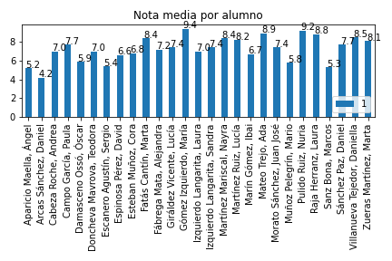

# Acta de la 1ª evaluación 

## Informe actilla: 
  

## Resultados generales: 

### Resumen 

  |   Eval |   N_al |   Media |   N_susp |   Susp_alu |
|:------:|:------:|:-------:|:--------:|:----------:|
|      1 |      4 |    7.42 |        1 |       0.25 |  
Tenemos los siguientes datos: 
 la nota media es 7.42, el número de suspensos es 1, el número de suspensos por alumno es 0.25 
 

### Resumen de suspensos 

 
 |         |   0 susp. |   1 susp. |   2 susp. |   3 ó 4 susp. |   > 4 susp. |
|:-------:|:---------:|:---------:|:---------:|:-------------:|:-----------:|
| Alumnos |         3 |         1 |         0 |             0 |           0 | 

 
  
 
 
 Alumnos con suspensos: 

* Con 1 asignaturas: 

    - Alumno_4 (HE) 
 

### Resumen de nota media 

 |         |   [0, 3) |   [3, 4) |   [4, 5) |   [5, 6) |   [6, 7) |   [7, 9) |   [9, 10) |
|:-------:|:--------:|:--------:|:--------:|:--------:|:--------:|:--------:|:---------:|
| Alumnos |        0 |        0 |        0 |        0 |        0 |        4 |         0 | 

  
 

## Alumnos 

### Notas medias 

 | Alumno   |   ('Media', 1) |
|:--------:|:--------------:|
| Alumno_1 |           7.11 |
| Alumno_2 |           8.12 |
| Alumno_3 |           7.38 |
| Alumno_4 |           7.12 | 

  
 

### Resultados por alumno 

#### Alumno_1 

  Alumno_1 en la 1ªev: 
 la nota media es 7.11, el número de suspensos es 0 
  

|   Eval |   2FR II |   BI |   CTM |   HE |   IN II |   LC2 |   MA2 |   PSC |   QU |
|:------:|:--------:|:----:|:-----:|:----:|:-------:|:-----:|:-----:|:-----:|:----:|
|      1 |        8 |    7 |     7 |    5 |      10 |     6 |     7 |     8 |    6 |

Por tanto: 2FR II es 8, BI es 7, CTM es 7, HE es 5, IN II es 10, LC2 es 6, MA2 es 7, PSC es 8, QU es 6 
 

#### Alumno_2 

  Alumno_2 en la 1ªev: 
 la nota media es 8.12, el número de suspensos es 0 
  

|   Eval |   2FR II |   BI |   CTM |   HE |   IN II |   LC2 |   MA2 |   QU |
|:------:|:--------:|:----:|:-----:|:----:|:-------:|:-----:|:-----:|:----:|
|      1 |        7 |    8 |     9 |    7 |       9 |     7 |     9 |    9 |

Por tanto: 2FR II es 7, BI es 8, CTM es 9, HE es 7, IN II es 9, LC2 es 7, MA2 es 9, QU es 9 
 

#### Alumno_3 

  Alumno_3 en la 1ªev: 
 la nota media es 7.38, el número de suspensos es 0 
  

|   Eval |   2FR II |   BI |   CTM |   HE |   IN II |   LC2 |   MA2 |   QU |
|:------:|:--------:|:----:|:-----:|:----:|:-------:|:-----:|:-----:|:----:|
|      1 |        8 |    7 |     9 |    6 |       9 |     7 |     7 |    6 |

Por tanto: 2FR II es 8, BI es 7, CTM es 9, HE es 6, IN II es 9, LC2 es 7, MA2 es 7, QU es 6 
 

#### Alumno_4 

  Alumno_4 en la 1ªev: 
 la nota media es 7.12, el número de suspensos es 1 
  

* Suspende 1 asignaturas: HE 

|   Eval |   BI |   CTM |   HE |   IN II |   LC2 |   MA2 |   PS |   QU |
|:------:|:----:|:-----:|:----:|:-------:|:-----:|:-----:|:----:|:----:|
|      1 |    7 |     8 |    3 |       7 |     7 |    10 |    8 |    7 |

Por tanto: BI es 7, CTM es 8, HE es 3, IN II es 7, LC2 es 7, MA2 es 10, PS es 8, QU es 7 
 