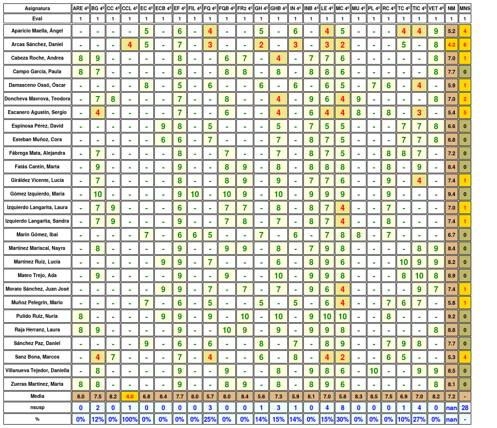
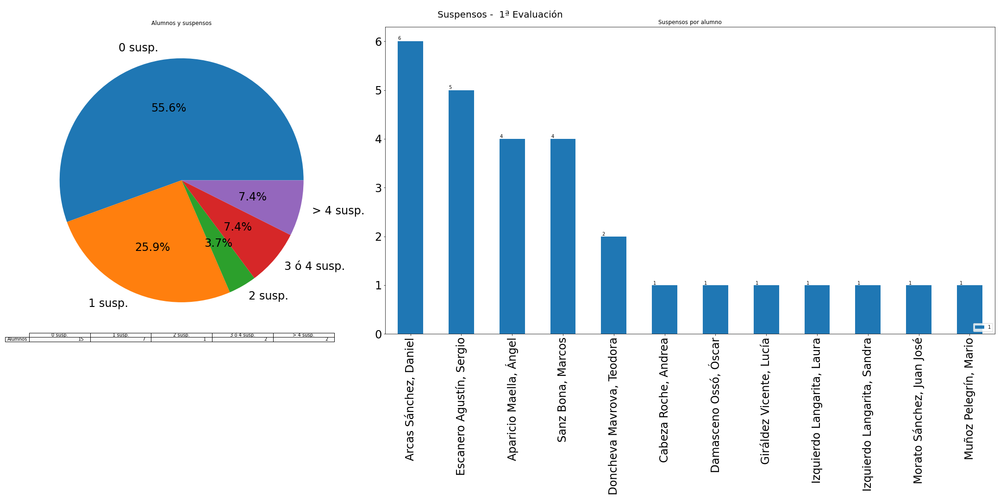

---
title: "Acta de la 1ª evaluación" 
author: IES Pedro Cerrada
date: 4ºESO B
titlepage: true
logo: headerright
geometry: landscape,margin=1in
keywords: [Acta]
... 
# Acta de la 1ª evaluación 

 \newpage 

## Resultados generales: 
A nivel de grupo, se tienen los siguientes datos: 
 
* **nota media**: 7.48 
* **número de suspensos**: 13 
* **número de suspensos por alumno**: 0.48 
  
 El número de alumnos por suspensos se distribuyen de la siguiente manera: 

* **0 susp.**: 21 
* **1 susp.**: 2 
* **2 susp.**: 2 
* **3 ó 4 susp.**: 2 
* **> 4 susp.**: 0 
  
 
 
 Gráficamente: 
 
  
 
 
 Alumnos con suspensos: 

* Con **4** asignaturas: 

    - Arcas Sánchez, Daniel (FQ, GH, IN, LE) 
 

* Con **3** asignaturas: 

    - Sanz Bona, Marcos (BG, FQ, LE) 
 

* Con **2** asignaturas: 

    - Aparicio Maella, Ángel (FQ, LE) 
 

    - Escanero Agustín, Sergio (GHB, LE) 
 

* Con **1** asignaturas: 

    - Cabeza Roche, Andrea (GHB) 
 

    - Doncheva Mavrova, Teodora (GHB) 
 
El número de alumnos por nota media se distribuye de la siguiente manera: 

* **[0, 3)**: 0 
* **[3, 4)**: 0 
* **[4, 5)**: 1 
* **[5, 6)**: 2 
* **[6, 7)**: 5 
* **[7, 9)**: 16 
* **[9, 10)**: 3 
  
 

 Gráficamente 
 
  
 

## Resultados por alumno 

### Aparicio Maella, Ángel 

 * **Nota media**: 5.57, **Número de suspensos**: 2 
  
 

* Suspensos: FQ, LE 

|   Eval |   EC |   EF |   FQ |   GH |   IN |   LE |   VET |
|:------:|:----:|:----:|:----:|:----:|:----:|:----:|:-----:|
|      1 |    5 |    6 |    4 |    5 |    6 |    4 |     9 |

 * En concreto: **EC**: 5, **EF**: 6, **FQ**: 4, **GH**: 5, **IN**: 6, **LE**: 4, **VET**: 9 
  
 

### Arcas Sánchez, Daniel 

 * **Nota media**: 4.43, **Número de suspensos**: 4 
  
 

* Suspensos: FQ, GH, IN, LE 

|   Eval |   EC |   EF |   FQ |   GH |   IN |   LE |   VET |
|:------:|:----:|:----:|:----:|:----:|:----:|:----:|:-----:|
|      1 |    5 |    7 |    3 |    2 |    3 |    3 |     8 |

 * En concreto: **EC**: 5, **EF**: 7, **FQ**: 3, **GH**: 2, **IN**: 3, **LE**: 3, **VET**: 8 
  
 

### Cabeza Roche, Andrea 

 * **Nota media**: 7.11, **Número de suspensos**: 1 
  
 

* Suspensos: GHB 

|   Eval |   ARE |   BG |   EF |   FQB |   FR2 |   GHB |   INB |   LE |   VET |
|:------:|:-----:|:----:|:----:|:-----:|:-----:|:-----:|:-----:|:----:|:-----:|
|      1 |     8 |    9 |    8 |     6 |     7 |     4 |     7 |    7 |     8 |

 * En concreto: **ARE**: 8, **BG**: 9, **EF**: 8, **FQB**: 6, **FR2**: 7, **GHB**: 4, **INB**: 7, **LE**: 7, **VET**: 8 
  
 

### Campo García, Paula 

 * **Nota media**: 7.89, **Número de suspensos**: 0 
  
 
|   Eval |   ARE |   BG |   EF |   FQB |   FR2 |   GHB |   INB |   LE |   VET |
|:------:|:-----:|:----:|:----:|:-----:|:-----:|:-----:|:-----:|:----:|:-----:|
|      1 |     8 |    7 |    8 |     8 |     8 |     8 |     8 |    8 |     8 |

 * En concreto: **ARE**: 8, **BG**: 7, **EF**: 8, **FQB**: 8, **FR2**: 8, **GHB**: 8, **INB**: 8, **LE**: 8, **VET**: 8 
  
 

### Damasceno Ossó, Óscar 

 * **Nota media**: 6.25, **Número de suspensos**: 0 
  
 
|   Eval |   EC |   EF |   FQ |   GH |   IN |   LE |   PL |   RC |
|:------:|:----:|:----:|:----:|:----:|:----:|:----:|:----:|:----:|
|      1 |    8 |    5 |    6 |    6 |    6 |    6 |    7 |    6 |

 * En concreto: **EC**: 8, **EF**: 5, **FQ**: 6, **GH**: 6, **IN**: 6, **LE**: 6, **PL**: 7, **RC**: 6 
  
 

### Doncheva Mavrova, Teodora 

 * **Nota media**: 7.33, **Número de suspensos**: 1 
  
 

* Suspensos: GHB 

|   Eval |   BG |   CC |   EF |   FQB |   GHB |   INB |   LE |   MU |   VET |
|:------:|:----:|:----:|:----:|:-----:|:-----:|:-----:|:----:|:----:|:-----:|
|      1 |    7 |    8 |    7 |     8 |     4 |     9 |    6 |    9 |     8 |

 * En concreto: **BG**: 7, **CC**: 8, **EF**: 7, **FQB**: 8, **GHB**: 4, **INB**: 9, **LE**: 6, **MU**: 9, **VET**: 8 
  
 

### Escanero Agustín, Sergio 

 * **Nota media**: 6.14, **Número de suspensos**: 2 
  
 

* Suspensos: GHB, LE 

|   Eval |   EF |   FQB |   GHB |   INB |   LE |   MU |   RC |
|:------:|:----:|:-----:|:-----:|:-----:|:----:|:----:|:----:|
|      1 |    7 |     6 |     4 |     6 |    4 |    8 |    8 |

 * En concreto: **EF**: 7, **FQB**: 6, **GHB**: 4, **INB**: 6, **LE**: 4, **MU**: 8, **RC**: 8 
  
 

### Espinosa Pérez, David 

 * **Nota media**: 6.71, **Número de suspensos**: 0 
  
 
|   Eval |   ECB |   EF |   FQ |   GHB |   INB |   LE |   VET |
|:------:|:-----:|:----:|:----:|:-----:|:-----:|:----:|:-----:|
|      1 |     9 |    8 |    5 |     5 |     7 |    5 |     8 |

 * En concreto: **ECB**: 9, **EF**: 8, **FQ**: 5, **GHB**: 5, **INB**: 7, **LE**: 5, **VET**: 8 
  
 

### Esteban Muñoz, Cora 

 * **Nota media**: 7, **Número de suspensos**: 0 
  
 
|   Eval |   ECB |   EF |   FQ |   GHB |   INB |   LE |   VET |
|:------:|:-----:|:----:|:----:|:-----:|:-----:|:----:|:-----:|
|      1 |     6 |    6 |    7 |     7 |     8 |    7 |     8 |

 * En concreto: **ECB**: 6, **EF**: 6, **FQ**: 7, **GHB**: 7, **INB**: 8, **LE**: 7, **VET**: 8 
  
 

### Fatás Cantín, Marta 

 * **Nota media**: 8.38, **Número de suspensos**: 0 
  
 
|   Eval |   BG |   EF |   FQB |   FR2 |   GHB |   INB |   LE |   RC |
|:------:|:----:|:----:|:-----:|:-----:|:-----:|:-----:|:----:|:----:|
|      1 |    9 |    9 |     8 |     9 |     8 |     8 |    8 |    8 |

 * En concreto: **BG**: 9, **EF**: 9, **FQB**: 8, **FR2**: 9, **GHB**: 8, **INB**: 8, **LE**: 8, **RC**: 8 
  
 

### Fábrega Mata, Alejandra 

 * **Nota media**: 7.43, **Número de suspensos**: 0 
  
 
|   Eval |   BG |   EF |   FQB |   GHB |   INB |   LE |   RC |
|:------:|:----:|:----:|:-----:|:-----:|:-----:|:----:|:----:|
|      1 |    7 |    8 |     7 |     7 |     8 |    7 |    8 |

 * En concreto: **BG**: 7, **EF**: 8, **FQB**: 7, **GHB**: 7, **INB**: 8, **LE**: 7, **RC**: 8 
  
 

### Giráldez Vicente, Lucía 

 * **Nota media**: 8, **Número de suspensos**: 0 
  
 
|   Eval |   BG |   EF |   FQB |   FR2 |   GHB |   INB |   LE |   RC |
|:------:|:----:|:----:|:-----:|:-----:|:-----:|:-----:|:----:|:----:|
|      1 |    7 |    8 |     8 |     9 |     9 |     7 |    7 |    9 |

 * En concreto: **BG**: 7, **EF**: 8, **FQB**: 8, **FR2**: 9, **GHB**: 9, **INB**: 7, **LE**: 7, **RC**: 9 
  
 

### Gómez Izquierdo, María 

 * **Nota media**: 9.44, **Número de suspensos**: 0 
  
 
|   Eval |   BG |   EF |   FIL |   FQB |   FR2 |   GHB |   INB |   LE |   RC |
|:------:|:----:|:----:|:-----:|:-----:|:-----:|:-----:|:-----:|:----:|:----:|
|      1 |   10 |    9 |    10 |    10 |     9 |    10 |     9 |    9 |    9 |

 * En concreto: **BG**: 10, **EF**: 9, **FIL**: 10, **FQB**: 10, **FR2**: 9, **GHB**: 10, **INB**: 9, **LE**: 9, **RC**: 9 
  
 

### Izquierdo Langarita, Laura 

 * **Nota media**: 7.33, **Número de suspensos**: 0 
  
 
|   Eval |   BG |   CC |   EF |   FQB |   FR2 |   GHB |   INB |   LE |   RC |
|:------:|:----:|:----:|:----:|:-----:|:-----:|:-----:|:-----:|:----:|:----:|
|      1 |    7 |    9 |    6 |     7 |     7 |     8 |     8 |    7 |    7 |

 * En concreto: **BG**: 7, **CC**: 9, **EF**: 6, **FQB**: 7, **FR2**: 7, **GHB**: 8, **INB**: 8, **LE**: 7, **RC**: 7 
  
 

### Izquierdo Langarita, Sandra 

 * **Nota media**: 7.78, **Número de suspensos**: 0 
  
 
|   Eval |   BG |   CC |   EF |   FQB |   FR2 |   GHB |   INB |   LE |   RC |
|:------:|:----:|:----:|:----:|:-----:|:-----:|:-----:|:-----:|:----:|:----:|
|      1 |    7 |    9 |    9 |     7 |     8 |     7 |     8 |    7 |    8 |

 * En concreto: **BG**: 7, **CC**: 9, **EF**: 9, **FQB**: 7, **FR2**: 8, **GHB**: 7, **INB**: 8, **LE**: 7, **RC**: 8 
  
 

### Martínez Mariscal, Nayra 

 * **Nota media**: 8.22, **Número de suspensos**: 0 
  
 
|   Eval |   BG |   EF |   FQB |   FR2 |   GHB |   INB |   LE |   TIC |   VET |
|:------:|:----:|:----:|:-----:|:-----:|:-----:|:-----:|:----:|:-----:|:-----:|
|      1 |    8 |    7 |     9 |     9 |     8 |     7 |    9 |     8 |     9 |

 * En concreto: **BG**: 8, **EF**: 7, **FQB**: 9, **FR2**: 9, **GHB**: 8, **INB**: 7, **LE**: 9, **TIC**: 8, **VET**: 9 
  
 

### Martínez Ruiz, Lucía 

 * **Nota media**: 8.25, **Número de suspensos**: 0 
  
 
|   Eval |   ECB |   EF |   FQ |   GHB |   INB |   LE |   TIC |   VET |
|:------:|:-----:|:----:|:----:|:-----:|:-----:|:----:|:-----:|:-----:|
|      1 |     9 |    9 |    7 |     6 |     8 |    9 |     9 |     9 |

 * En concreto: **ECB**: 9, **EF**: 9, **FQ**: 7, **GHB**: 6, **INB**: 8, **LE**: 9, **TIC**: 9, **VET**: 9 
  
 

### Marín Gómez, Ibai 

 * **Nota media**: 6.56, **Número de suspensos**: 0 
  
 
|   Eval |   EC |   EF |   FIL |   FQ |   GH |   IN |   LE |   MU |   RC |
|:------:|:----:|:----:|:-----:|:----:|:----:|:----:|:----:|:----:|:----:|
|      1 |    7 |    6 |     6 |    5 |    7 |    6 |    7 |    8 |    7 |

 * En concreto: **EC**: 7, **EF**: 6, **FIL**: 6, **FQ**: 5, **GH**: 7, **IN**: 6, **LE**: 7, **MU**: 8, **RC**: 7 
  
 

### Mateo Trejo, Ada 

 * **Nota media**: 9.12, **Número de suspensos**: 0 
  
 
|   Eval |   BG |   EF |   FQB |   GHB |   INB |   LE |   TIC |   VET |
|:------:|:----:|:----:|:-----:|:-----:|:-----:|:----:|:-----:|:-----:|
|      1 |    9 |    9 |     9 |    10 |     9 |    9 |    10 |     8 |

 * En concreto: **BG**: 9, **EF**: 9, **FQB**: 9, **GHB**: 10, **INB**: 9, **LE**: 9, **TIC**: 10, **VET**: 8 
  
 

### Morato Sánchez, Juan José 

 * **Nota media**: 7.78, **Número de suspensos**: 0 
  
 
|   Eval |   ECB |   EF |   FQ |   FR2 |   GHB |   INB |   LE |   TIC |   VET |
|:------:|:-----:|:----:|:----:|:-----:|:-----:|:-----:|:----:|:-----:|:-----:|
|      1 |     9 |    9 |    7 |     7 |     7 |     9 |    6 |     9 |     7 |

 * En concreto: **ECB**: 9, **EF**: 9, **FQ**: 7, **FR2**: 7, **GHB**: 7, **INB**: 9, **LE**: 6, **TIC**: 9, **VET**: 7 
  
 

### Muñoz Pelegrín, Mario 

 * **Nota media**: 6, **Número de suspensos**: 0 
  
 
|   Eval |   EC |   EF |   FQ |   GH |   IN |   LE |   RC |   TIC |
|:------:|:----:|:----:|:----:|:----:|:----:|:----:|:----:|:-----:|
|      1 |    7 |    6 |    5 |    5 |    5 |    6 |    7 |     7 |

 * En concreto: **EC**: 7, **EF**: 6, **FQ**: 5, **GH**: 5, **IN**: 5, **LE**: 6, **RC**: 7, **TIC**: 7 
  
 

### Pulido Ruiz, Nuria 

 * **Nota media**: 9.11, **Número de suspensos**: 0 
  
 
|   Eval |   ARE |   ECB |   EF |   FQ |   FR2 |   GHB |   INB |   LE |   RC |
|:------:|:-----:|:-----:|:----:|:----:|:-----:|:-----:|:-----:|:----:|:----:|
|      1 |     8 |     9 |    9 |    9 |    10 |    10 |     9 |   10 |    8 |

 * En concreto: **ARE**: 8, **ECB**: 9, **EF**: 9, **FQ**: 9, **FR2**: 10, **GHB**: 10, **INB**: 9, **LE**: 10, **RC**: 8 
  
 

### Raja Herranz, Laura 

 * **Nota media**: 8.67, **Número de suspensos**: 0 
  
 
|   Eval |   ARE |   BG |   EF |   FQB |   FR2 |   GHB |   INB |   LE |   VET |
|:------:|:-----:|:----:|:----:|:-----:|:-----:|:-----:|:-----:|:----:|:-----:|
|      1 |     8 |    9 |    7 |    10 |     9 |     9 |     9 |    9 |     8 |

 * En concreto: **ARE**: 8, **BG**: 9, **EF**: 7, **FQB**: 10, **FR2**: 9, **GHB**: 9, **INB**: 9, **LE**: 9, **VET**: 8 
  
 

### Sanz Bona, Marcos 

 * **Nota media**: 5.75, **Número de suspensos**: 3 
  
 

* Suspensos: BG, FQ, LE 

|   Eval |   BG |   CC |   EF |   FQ |   GH |   IN |   LE |   RC |
|:------:|:----:|:----:|:----:|:----:|:----:|:----:|:----:|:----:|
|      1 |    4 |    7 |    7 |    4 |    6 |    8 |    4 |    6 |

 * En concreto: **BG**: 4, **CC**: 7, **EF**: 7, **FQ**: 4, **GH**: 6, **IN**: 8, **LE**: 4, **RC**: 6 
  
 

### Sánchez Paz, Daniel 

 * **Nota media**: 7.38, **Número de suspensos**: 0 
  
 
|   Eval |   EC |   EF |   FQ |   GH |   IN |   LE |   RC |   TIC |
|:------:|:----:|:----:|:----:|:----:|:----:|:----:|:----:|:-----:|
|      1 |    9 |    6 |    6 |    8 |    7 |    8 |    7 |     8 |

 * En concreto: **EC**: 9, **EF**: 6, **FQ**: 6, **GH**: 8, **IN**: 7, **LE**: 8, **RC**: 7, **TIC**: 8 
  
 

### Villanueva Tejedor, Daniella 

 * **Nota media**: 8.5, **Número de suspensos**: 0 
  
 
|   Eval |   BG |   EF |   FQB |   GHB |   INB |   LE |   TIC |   VET |
|:------:|:----:|:----:|:-----:|:-----:|:-----:|:----:|:-----:|:-----:|
|      1 |    7 |    9 |     9 |     8 |     9 |    8 |     9 |     9 |

 * En concreto: **BG**: 7, **EF**: 9, **FQB**: 9, **GHB**: 8, **INB**: 9, **LE**: 8, **TIC**: 9, **VET**: 9 
  
 

### Zueras Martínez, Marta 

 * **Nota media**: 8.11, **Número de suspensos**: 0 
  
 
|   Eval |   ARE |   BG |   EF |   FQB |   FR2 |   GHB |   INB |   LE |   VET |
|:------:|:-----:|:----:|:----:|:-----:|:-----:|:-----:|:-----:|:----:|:-----:|
|      1 |     8 |    8 |    7 |     8 |     9 |     8 |     8 |    9 |     8 |

 * En concreto: **ARE**: 8, **BG**: 8, **EF**: 7, **FQB**: 8, **FR2**: 9, **GHB**: 8, **INB**: 8, **LE**: 9, **VET**: 8 
  
 