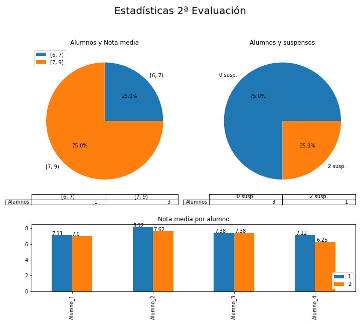

# Resultados de la 2ª evaluación 

 
  
 

ewpage
 
  
 

### Resultados por alumno 

#### Alumno_1 

  Alumno_1 en la 2ªev: 
 
 * **Baja** la nota media: Pasa de 7.11 a 7.0. 
 * Mantiene el número de suspensos 0.  
  

|   Eval |   2FR II |   BI |   CTM |   HE |   IN II |   LC2 |   MA2 |   PSC |   QU |
|:------:|:--------:|:----:|:-----:|:----:|:-------:|:-----:|:-----:|:-----:|:----:|
|      1 |        8 |    7 |     7 |    5 |      10 |     6 |     7 |     8 |    6 |
|      2 |        7 |    5 |     7 |    6 |      10 |     5 |     7 |     9 |    7 |

Por tanto: **Baja** en 2FR II: Pasa de 8 a 7. **Baja** en BI: Pasa de 7 a 5. Sube en HE: Pasa de 5 a 6. **Baja** en LC2: Pasa de 6 a 5. Sube en PSC: Pasa de 8 a 9. Sube en QU: Pasa de 6 a 7.  
 

#### Alumno_2 

  Alumno_2 en la 2ªev: 
 
 * **Baja** la nota media: Pasa de 8.12 a 7.62. 
 * Mantiene el número de suspensos 0.  
  

|   Eval |   2FR II |   BI |   CTM |   HE |   IN II |   LC2 |   MA2 |   QU |
|:------:|:--------:|:----:|:-----:|:----:|:-------:|:-----:|:-----:|:----:|
|      1 |        7 |    8 |     9 |    7 |       9 |     7 |     9 |    9 |
|      2 |        8 |    7 |     8 |    7 |       9 |     7 |     8 |    7 |

Por tanto: Sube en 2FR II: Pasa de 7 a 8. **Baja** en BI: Pasa de 8 a 7. **Baja** en CTM: Pasa de 9 a 8. **Baja** en MA2: Pasa de 9 a 8. **Baja** en QU: Pasa de 9 a 7.  
 

#### Alumno_3 

  Alumno_3 en la 2ªev: 
 
 * Mantiene la nota media 7.38. 
 * Mantiene el número de suspensos 0.  
  

|   Eval |   2FR II |   BI |   CTM |   HE |   IN II |   LC2 |   MA2 |   QU |
|:------:|:--------:|:----:|:-----:|:----:|:-------:|:-----:|:-----:|:----:|
|      1 |        8 |    7 |     9 |    6 |       9 |     7 |     7 |    6 |
|      2 |        7 |    8 |     8 |    6 |       9 |     5 |     8 |    8 |

Por tanto: **Baja** en 2FR II: Pasa de 8 a 7. Sube en BI: Pasa de 7 a 8. **Baja** en CTM: Pasa de 9 a 8. **Baja** en LC2: Pasa de 7 a 5. Sube en MA2: Pasa de 7 a 8. Sube en QU: Pasa de 6 a 8.  
 

#### Alumno_4 

  Alumno_4 en la 2ªev: 
 
 * **Baja** la nota media: Pasa de 7.12 a 6.25. 
 * Sube el número de suspensos: Pasa de 1 a 2.  
  

* Suspende 2 asignaturas: HE, PS 

|   Eval |   BI |   CTM |   HE |   IN II |   LC2 |   MA2 |   PS |   QU |
|:------:|:----:|:-----:|:----:|:-------:|:-----:|:-----:|:----:|:----:|
|      1 |    7 |     8 |    3 |       7 |     7 |    10 |    8 |    7 |
|      2 |    7 |     7 |    2 |       8 |     6 |    10 |    2 |    8 |

Por tanto: **Baja** en CTM: Pasa de 8 a 7. **Baja** en HE: Pasa de 3 a 2. Sube en IN II: Pasa de 7 a 8. **Baja** en LC2: Pasa de 7 a 6. **Baja** en PS: Pasa de 8 a 2. Sube en QU: Pasa de 7 a 8.  
 