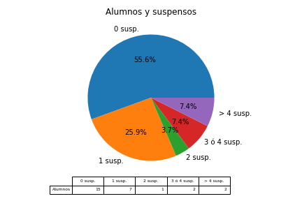

# Acta de la 2ª evaluación 

## Informe actilla: 
  

## Resultados generales: 

###Resumen 

  |   Eval |   N_al |   Media |   N_susp |   Susp_alu |
|-------:|-------:|--------:|---------:|-----------:|
|      1 |      4 |    7.42 |        1 |       0.25 |
|      2 |      4 |    7.06 |        2 |       0.5  |  
Tenemos los siguientes datos: 
 
 * **Baja** la nota media: Pasa de 7.42 a 7.06. 
 * Sube el número de suspensos: Pasa de 1 a 2. 
 * Sube el número de suspensos por alumno: Pasa de 0.25 a 0.5.  
 
 ### Resumen de suspensos 

 
 |         |   0 susp. |   1 susp. |   2 susp. |   3 ó 4 susp. |   > 4 susp. |
|:--------|----------:|----------:|----------:|--------------:|------------:|
| Alumnos |         3 |         0 |         1 |             0 |           0 | 

 
  
 
 
 Alumnos con suspensos: 

* Con 2 asignaturas: 

    - Alumno_4 (HE, PS) 
 

### Resumen de nota media 

 |         |   [0, 3) |   [3, 4) |   [4, 5) |   [5, 6) |   [6, 7) |   [7, 9) |   [9, 10) |
|:--------|---------:|---------:|---------:|---------:|---------:|---------:|----------:|
| Alumnos |        0 |        0 |        0 |        0 |        1 |        3 |         0 | 

  
 

 ## Alumnos 

 ### Notas medias 
 | Alumno   |   ('Media', 1) |   ('Media', 2) |
|:---------|---------------:|---------------:|
| Alumno_1 |           7.11 |           7    |
| Alumno_2 |           8.12 |           7.62 |
| Alumno_3 |           7.38 |           7.38 |
| Alumno_4 |           7.12 |           6.25 | 

  
 

 ### Resultados por alumno 

 #### Alumno_1 

 Los resultados de Alumno_1 en la 2ªev han sido: 
 
 * **Baja** la nota media: Pasa de 7.11 a 7.0. 
 * Se mantiene el número de suspensos: Se mantiene en 0.  
  

|   Eval |   2FR II |   BI |   CTM |   HE |   IN II |   LC2 |   MA2 |   PSC |   QU |
|-------:|---------:|-----:|------:|-----:|--------:|------:|------:|------:|-----:|
|      1 |        8 |    7 |     7 |    5 |      10 |     6 |     7 |     8 |    6 |
|      2 |        7 |    5 |     7 |    6 |      10 |     5 |     7 |     9 |    7 |

Los resultados han sido: 
 **Baja** en 2FR II: Pasa de 8 a 7. **Baja** en BI: Pasa de 7 a 5. Sube en HE: Pasa de 5 a 6. **Baja** en LC2: Pasa de 6 a 5. Sube en PSC: Pasa de 8 a 9. Sube en QU: Pasa de 6 a 7.  
 
 #### Alumno_2 

 Los resultados de Alumno_2 en la 2ªev han sido: 
 
 * **Baja** la nota media: Pasa de 8.12 a 7.62. 
 * Se mantiene el número de suspensos: Se mantiene en 0.  
  

|   Eval |   2FR II |   BI |   CTM |   HE |   IN II |   LC2 |   MA2 |   QU |
|-------:|---------:|-----:|------:|-----:|--------:|------:|------:|-----:|
|      1 |        7 |    8 |     9 |    7 |       9 |     7 |     9 |    9 |
|      2 |        8 |    7 |     8 |    7 |       9 |     7 |     8 |    7 |

Los resultados han sido: 
 Sube en 2FR II: Pasa de 7 a 8. **Baja** en BI: Pasa de 8 a 7. **Baja** en CTM: Pasa de 9 a 8. **Baja** en MA2: Pasa de 9 a 8. **Baja** en QU: Pasa de 9 a 7.  
 
 #### Alumno_3 

 Los resultados de Alumno_3 en la 2ªev han sido: 
 
 * Se mantiene la nota media: Se mantiene en 7.38. 
 * Se mantiene el número de suspensos: Se mantiene en 0.  
  

|   Eval |   2FR II |   BI |   CTM |   HE |   IN II |   LC2 |   MA2 |   QU |
|-------:|---------:|-----:|------:|-----:|--------:|------:|------:|-----:|
|      1 |        8 |    7 |     9 |    6 |       9 |     7 |     7 |    6 |
|      2 |        7 |    8 |     8 |    6 |       9 |     5 |     8 |    8 |

Los resultados han sido: 
 **Baja** en 2FR II: Pasa de 8 a 7. Sube en BI: Pasa de 7 a 8. **Baja** en CTM: Pasa de 9 a 8. **Baja** en LC2: Pasa de 7 a 5. Sube en MA2: Pasa de 7 a 8. Sube en QU: Pasa de 6 a 8.  
 
 #### Alumno_4 

 Los resultados de Alumno_4 en la 2ªev han sido: 
 
 * **Baja** la nota media: Pasa de 7.12 a 6.25. 
 * Sube el número de suspensos: Pasa de 1 a 2.  
  

Suspende 2 asignaturas: HE, PS 

|   Eval |   BI |   CTM |   HE |   IN II |   LC2 |   MA2 |   PS |   QU |
|-------:|-----:|------:|-----:|--------:|------:|------:|-----:|-----:|
|      1 |    7 |     8 |    3 |       7 |     7 |    10 |    8 |    7 |
|      2 |    7 |     7 |    2 |       8 |     6 |    10 |    2 |    8 |

Los resultados han sido: 
 **Baja** en CTM: Pasa de 8 a 7. **Baja** en HE: Pasa de 3 a 2. Sube en IN II: Pasa de 7 a 8. **Baja** en LC2: Pasa de 7 a 6. **Baja** en PS: Pasa de 8 a 2. Sube en QU: Pasa de 7 a 8.  
 