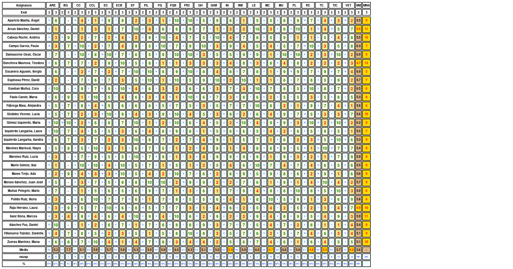
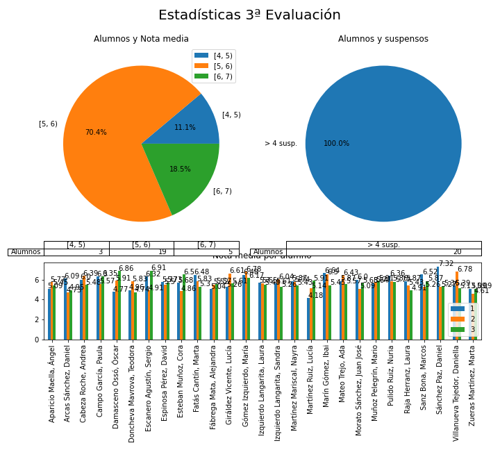

# Resultados de la 3ª evaluación 

 
  
 

ewpage
 
  
 

### Resultados por alumno 

#### Aparicio Maella, Ángel 

  Aparicio Maella, Ángel en la 3ªev: 
 
 * **Baja** la nota media: Pasa de 5.77 a 5.45. 
 * Mantiene el número de suspensos 9.  
  

* Suspende 9 asignaturas: CC, CCL, EF, FIL, FQ, INB, TC, TIC, VET 

|   Eval |   ARE |   CC |   CCL |   EC |   ECB |   EF |   FIL |   FQ |   FQB |   FR2 |   GH |   GHB |   IN |   INB |   LE |   MC |   MU |   PL |   RC |   TC |   TIC |   VET |
|:------:|:-----:|:----:|:-----:|:----:|:-----:|:----:|:-----:|:----:|:-----:|:-----:|:----:|:-----:|:----:|:-----:|:----:|:----:|:----:|:----:|:----:|:----:|:-----:|:-----:|
|      1 |     8 |    4 |     3 |    1 |     6 |    8 |     2 |   10 |     5 |     1 |    1 |    10 |    5 |     1 |    8 |    3 |    1 |    6 |    8 |    9 |     6 |     6 |
|      2 |     2 |   10 |     9 |   10 |     1 |    7 |     5 |    2 |     8 |     5 |   10 |     2 |    1 |     2 |    7 |    4 |    4 |    5 |   10 |    4 |     9 |    10 |
|      3 |     8 |    4 |     1 |    9 |     8 |    2 |     3 |    1 |    10 |    10 |    5 |     9 |    6 |     1 |    5 |    5 |    8 |    9 |    7 |    4 |     3 |     2 |

Por tanto: Sube en ARE: Pasa de 2 a 8. **Baja** en CC: Pasa de 10 a 4. **Baja** en CCL: Pasa de 9 a 1. **Baja** en EC: Pasa de 10 a 9. Sube en ECB: Pasa de 1 a 8. **Baja** en EF: Pasa de 7 a 2. **Baja** en FIL: Pasa de 5 a 3. **Baja** en FQ: Pasa de 2 a 1. Sube en FQB: Pasa de 8 a 10. Sube en FR2: Pasa de 5 a 10. **Baja** en GH: Pasa de 10 a 5. Sube en GHB: Pasa de 2 a 9. Sube en IN: Pasa de 1 a 6. **Baja** en INB: Pasa de 2 a 1. **Baja** en LE: Pasa de 7 a 5. Sube en MC: Pasa de 4 a 5. Sube en MU: Pasa de 4 a 8. Sube en PL: Pasa de 5 a 9. **Baja** en RC: Pasa de 10 a 7. **Baja** en TIC: Pasa de 9 a 3. **Baja** en VET: Pasa de 10 a 2.  
 

#### Arcas Sánchez, Daniel 

  Arcas Sánchez, Daniel en la 3ªev: 
 
 * Sube la nota media: Pasa de 4.73 a 4.95. 
 * Sube el número de suspensos: Pasa de 10 a 11.  
  

* Suspende 11 asignaturas: ARE, CC, CCL, EC, FIL, GHB, IN, INB, MC, RC, TC 

|   Eval |   ARE |   CC |   CCL |   EC |   ECB |   EF |   FIL |   FQ |   FQB |   FR2 |   GH |   GHB |   IN |   INB |   LE |   MC |   MU |   PL |   RC |   TC |   TIC |   VET |
|:------:|:-----:|:----:|:-----:|:----:|:-----:|:----:|:-----:|:----:|:-----:|:-----:|:----:|:-----:|:----:|:-----:|:----:|:----:|:----:|:----:|:----:|:----:|:-----:|:-----:|
|      1 |     8 |    7 |     2 |    5 |     8 |    4 |     7 |   10 |     6 |     3 |    9 |     8 |    3 |     5 |    5 |    6 |    4 |    6 |    5 |    9 |     7 |     7 |
|      2 |     4 |    3 |     1 |    1 |     3 |    1 |     8 |    4 |     4 |     7 |    5 |     5 |    5 |     5 |    7 |    2 |    6 |    5 |    7 |   10 |    10 |     1 |
|      3 |     1 |    1 |     3 |    1 |     7 |   10 |     4 |    8 |     6 |     9 |    7 |     1 |    3 |     2 |   10 |    3 |    6 |   10 |    1 |    4 |     5 |     7 |

Por tanto: **Baja** en ARE: Pasa de 4 a 1. **Baja** en CC: Pasa de 3 a 1. Sube en CCL: Pasa de 1 a 3. Sube en ECB: Pasa de 3 a 7. Sube en EF: Pasa de 1 a 10. **Baja** en FIL: Pasa de 8 a 4. Sube en FQ: Pasa de 4 a 8. Sube en FQB: Pasa de 4 a 6. Sube en FR2: Pasa de 7 a 9. Sube en GH: Pasa de 5 a 7. **Baja** en GHB: Pasa de 5 a 1. **Baja** en IN: Pasa de 5 a 3. **Baja** en INB: Pasa de 5 a 2. Sube en LE: Pasa de 7 a 10. Sube en MC: Pasa de 2 a 3. Sube en PL: Pasa de 5 a 10. **Baja** en RC: Pasa de 7 a 1. **Baja** en TC: Pasa de 10 a 4. **Baja** en TIC: Pasa de 10 a 5. Sube en VET: Pasa de 1 a 7.  
 

#### Cabeza Roche, Andrea 

  Cabeza Roche, Andrea en la 3ªev: 
 
 * **Baja** la nota media: Pasa de 6.39 a 5.48. 
 * Sube el número de suspensos: Pasa de 5 a 10.  
  

* Suspende 10 asignaturas: ARE, CC, EC, ECB, EF, FQB, IN, PL, RC, TIC 

|   Eval |   ARE |   BG |   CC |   CCL |   EC |   ECB |   EF |   FIL |   FQ |   FQB |   FR2 |   GH |   GHB |   IN |   INB |   LE |   MC |   MU |   PL |   RC |   TC |   TIC |   VET |
|:------:|:-----:|:----:|:----:|:-----:|:----:|:-----:|:----:|:-----:|:----:|:-----:|:-----:|:----:|:-----:|:----:|:-----:|:----:|:----:|:----:|:----:|:----:|:----:|:-----:|:-----:|
|      1 |     9 |    9 |    2 |     9 |    3 |     4 |   10 |     5 |    7 |     5 |    10 |    9 |     4 |    5 |     7 |    3 |    4 |    1 |    3 |   10 |    7 |    10 |     2 |
|      2 |     5 |    9 |    7 |     4 |    4 |    10 |    5 |     9 |    8 |     6 |     9 |    6 |     3 |    8 |    10 |    5 |    9 |    1 |    7 |    6 |    2 |     6 |     8 |
|      3 |     3 |    9 |    2 |     7 |    2 |     4 |    2 |     9 |   10 |     4 |     7 |    5 |    10 |    4 |     7 |    8 |    5 |    9 |    1 |    1 |    5 |     4 |     8 |

Por tanto: **Baja** en ARE: Pasa de 5 a 3. **Baja** en CC: Pasa de 7 a 2. Sube en CCL: Pasa de 4 a 7. **Baja** en EC: Pasa de 4 a 2. **Baja** en ECB: Pasa de 10 a 4. **Baja** en EF: Pasa de 5 a 2. Sube en FQ: Pasa de 8 a 10. **Baja** en FQB: Pasa de 6 a 4. **Baja** en FR2: Pasa de 9 a 7. **Baja** en GH: Pasa de 6 a 5. Sube en GHB: Pasa de 3 a 10. **Baja** en IN: Pasa de 8 a 4. **Baja** en INB: Pasa de 10 a 7. Sube en LE: Pasa de 5 a 8. **Baja** en MC: Pasa de 9 a 5. Sube en MU: Pasa de 1 a 9. **Baja** en PL: Pasa de 7 a 1. **Baja** en RC: Pasa de 6 a 1. Sube en TC: Pasa de 2 a 5. **Baja** en TIC: Pasa de 6 a 4.  
 

#### Campo García, Paula 

  Campo García, Paula en la 3ªev: 
 
 * Sube la nota media: Pasa de 5.57 a 6.35. 
 * **Baja** el número de suspensos: Pasa de 9 a 7.  
  

* Suspende 7 asignaturas: ARE, CCL, ECB, GHB, INB, MC, TC 

|   Eval |   ARE |   BG |   CC |   CCL |   EC |   ECB |   EF |   FIL |   FQ |   FQB |   FR2 |   GH |   GHB |   IN |   INB |   LE |   MC |   MU |   PL |   RC |   TC |   TIC |   VET |
|:------:|:-----:|:----:|:----:|:-----:|:----:|:-----:|:----:|:-----:|:----:|:-----:|:-----:|:----:|:-----:|:----:|:-----:|:----:|:----:|:----:|:----:|:----:|:----:|:-----:|:-----:|
|      1 |    10 |    7 |    4 |    10 |    6 |     5 |    4 |     9 |    8 |     8 |     3 |    4 |     1 |    6 |     6 |    8 |    7 |    9 |   10 |    4 |    7 |     2 |     7 |
|      2 |    10 |    7 |    5 |     2 |    8 |     1 |    1 |     1 |    2 |     3 |     4 |    7 |     9 |    9 |     5 |    7 |    8 |    9 |    3 |   10 |    4 |     7 |     6 |
|      3 |     3 |    7 |   10 |     2 |    7 |     4 |    9 |     5 |   10 |     7 |     9 |   10 |     3 |    9 |     4 |    5 |    4 |    5 |    7 |   10 |    3 |     5 |     8 |

Por tanto: **Baja** en ARE: Pasa de 10 a 3. Sube en CC: Pasa de 5 a 10. **Baja** en EC: Pasa de 8 a 7. Sube en ECB: Pasa de 1 a 4. Sube en EF: Pasa de 1 a 9. Sube en FIL: Pasa de 1 a 5. Sube en FQ: Pasa de 2 a 10. Sube en FQB: Pasa de 3 a 7. Sube en FR2: Pasa de 4 a 9. Sube en GH: Pasa de 7 a 10. **Baja** en GHB: Pasa de 9 a 3. **Baja** en INB: Pasa de 5 a 4. **Baja** en LE: Pasa de 7 a 5. **Baja** en MC: Pasa de 8 a 4. **Baja** en MU: Pasa de 9 a 5. Sube en PL: Pasa de 3 a 7. **Baja** en TC: Pasa de 4 a 3. **Baja** en TIC: Pasa de 7 a 5. Sube en VET: Pasa de 6 a 8.  
 

#### Damasceno Ossó, Óscar 

  Damasceno Ossó, Óscar en la 3ªev: 
 
 * Sube la nota media: Pasa de 5.91 a 6.86. 
 * **Baja** el número de suspensos: Pasa de 8 a 5.  
  

* Suspende 5 asignaturas: GH, MC, RC, TC, VET 

|   Eval |   ARE |   CC |   CCL |   EC |   ECB |   EF |   FIL |   FQ |   FQB |   FR2 |   GH |   GHB |   IN |   INB |   LE |   MC |   MU |   PL |   RC |   TC |   TIC |   VET |
|:------:|:-----:|:----:|:-----:|:----:|:-----:|:----:|:-----:|:----:|:-----:|:-----:|:----:|:-----:|:----:|:-----:|:----:|:----:|:----:|:----:|:----:|:----:|:-----:|:-----:|
|      1 |     7 |    5 |     4 |    5 |     2 |    6 |     5 |    4 |     2 |     4 |    5 |     4 |    2 |     7 |    1 |    3 |    3 |   10 |    6 |    7 |    10 |     3 |
|      2 |     1 |    6 |     9 |   10 |     9 |    9 |     1 |    9 |     1 |     2 |   10 |     3 |    8 |     3 |    9 |    5 |    2 |    9 |    9 |    2 |     8 |     5 |
|      3 |     7 |   10 |     8 |   10 |     7 |    6 |     5 |    9 |    10 |    10 |    3 |     5 |    5 |     9 |    9 |    1 |   10 |   10 |    2 |    3 |    10 |     2 |

Por tanto: Sube en ARE: Pasa de 1 a 7. Sube en CC: Pasa de 6 a 10. **Baja** en CCL: Pasa de 9 a 8. **Baja** en ECB: Pasa de 9 a 7. **Baja** en EF: Pasa de 9 a 6. Sube en FIL: Pasa de 1 a 5. Sube en FQB: Pasa de 1 a 10. Sube en FR2: Pasa de 2 a 10. **Baja** en GH: Pasa de 10 a 3. Sube en GHB: Pasa de 3 a 5. **Baja** en IN: Pasa de 8 a 5. Sube en INB: Pasa de 3 a 9. **Baja** en MC: Pasa de 5 a 1. Sube en MU: Pasa de 2 a 10. Sube en PL: Pasa de 9 a 10. **Baja** en RC: Pasa de 9 a 2. Sube en TC: Pasa de 2 a 3. Sube en TIC: Pasa de 8 a 10. **Baja** en VET: Pasa de 5 a 2.  
 

#### Doncheva Mavrova, Teodora 

  Doncheva Mavrova, Teodora en la 3ªev: 
 
 * **Baja** la nota media: Pasa de 5.83 a 4.74. 
 * Sube el número de suspensos: Pasa de 10 a 13.  
  

* Suspende 13 asignaturas: CCL, FQ, FQB, FR2, GH, GHB, IN, LE, MU, RC, TC, TIC, VET 

|   Eval |   ARE |   BG |   CC |   CCL |   EC |   ECB |   EF |   FIL |   FQ |   FQB |   FR2 |   GH |   GHB |   IN |   INB |   LE |   MC |   MU |   PL |   RC |   TC |   TIC |   VET |
|:------:|:-----:|:----:|:----:|:-----:|:----:|:-----:|:----:|:-----:|:----:|:-----:|:-----:|:----:|:-----:|:----:|:-----:|:----:|:----:|:----:|:----:|:----:|:----:|:-----:|:-----:|
|      1 |     4 |    7 |    4 |     1 |    6 |     8 |    1 |     1 |    8 |     8 |     3 |    6 |     1 |   10 |     1 |   10 |    5 |    9 |    6 |    2 |    2 |     4 |     7 |
|      2 |     9 |    7 |    4 |     4 |    7 |     9 |    9 |     4 |    3 |     9 |     2 |    1 |     1 |    8 |     4 |   10 |    9 |    8 |    1 |    9 |    1 |     6 |     9 |
|      3 |     6 |    7 |    7 |     2 |    9 |    10 |    5 |     8 |    1 |     1 |     3 |    3 |     3 |    4 |     8 |    3 |    8 |    4 |    8 |    2 |    2 |     2 |     3 |

Por tanto: **Baja** en ARE: Pasa de 9 a 6. Sube en CC: Pasa de 4 a 7. **Baja** en CCL: Pasa de 4 a 2. Sube en EC: Pasa de 7 a 9. Sube en ECB: Pasa de 9 a 10. **Baja** en EF: Pasa de 9 a 5. Sube en FIL: Pasa de 4 a 8. **Baja** en FQ: Pasa de 3 a 1. **Baja** en FQB: Pasa de 9 a 1. Sube en FR2: Pasa de 2 a 3. Sube en GH: Pasa de 1 a 3. Sube en GHB: Pasa de 1 a 3. **Baja** en IN: Pasa de 8 a 4. Sube en INB: Pasa de 4 a 8. **Baja** en LE: Pasa de 10 a 3. **Baja** en MC: Pasa de 9 a 8. **Baja** en MU: Pasa de 8 a 4. Sube en PL: Pasa de 1 a 8. **Baja** en RC: Pasa de 9 a 2. Sube en TC: Pasa de 1 a 2. **Baja** en TIC: Pasa de 6 a 2. **Baja** en VET: Pasa de 9 a 3.  
 

#### Escanero Agustín, Sergio 

  Escanero Agustín, Sergio en la 3ªev: 
 
 * Sube la nota media: Pasa de 4.91 a 6.91. 
 * **Baja** el número de suspensos: Pasa de 11 a 5.  
  

* Suspende 5 asignaturas: CC, EC, GHB, MC, VET 

|   Eval |   ARE |   CC |   CCL |   EC |   ECB |   EF |   FIL |   FQ |   FQB |   FR2 |   GH |   GHB |   IN |   INB |   LE |   MC |   MU |   PL |   RC |   TC |   TIC |   VET |
|:------:|:-----:|:----:|:-----:|:----:|:-----:|:----:|:-----:|:----:|:-----:|:-----:|:----:|:-----:|:----:|:-----:|:----:|:----:|:----:|:----:|:----:|:----:|:-----:|:-----:|
|      1 |     9 |    7 |     9 |    8 |     1 |   10 |     8 |    9 |     2 |     3 |    4 |     7 |   10 |     7 |    9 |   10 |    2 |    7 |    4 |    2 |     1 |    10 |
|      2 |     1 |    6 |    10 |    6 |    10 |    6 |     7 |    9 |     1 |     6 |    2 |     1 |    2 |     3 |    1 |    2 |    2 |   10 |    4 |    4 |     5 |    10 |
|      3 |     6 |    2 |     7 |    2 |     7 |   10 |    10 |    8 |     9 |    10 |    8 |     4 |    8 |     7 |    8 |    1 |    9 |    9 |    7 |    9 |     7 |     4 |

Por tanto: Sube en ARE: Pasa de 1 a 6. **Baja** en CC: Pasa de 6 a 2. **Baja** en CCL: Pasa de 10 a 7. **Baja** en EC: Pasa de 6 a 2. **Baja** en ECB: Pasa de 10 a 7. Sube en EF: Pasa de 6 a 10. Sube en FIL: Pasa de 7 a 10. **Baja** en FQ: Pasa de 9 a 8. Sube en FQB: Pasa de 1 a 9. Sube en FR2: Pasa de 6 a 10. Sube en GH: Pasa de 2 a 8. Sube en GHB: Pasa de 1 a 4. Sube en IN: Pasa de 2 a 8. Sube en INB: Pasa de 3 a 7. Sube en LE: Pasa de 1 a 8. **Baja** en MC: Pasa de 2 a 1. Sube en MU: Pasa de 2 a 9. **Baja** en PL: Pasa de 10 a 9. Sube en RC: Pasa de 4 a 7. Sube en TC: Pasa de 4 a 9. Sube en TIC: Pasa de 5 a 7. **Baja** en VET: Pasa de 10 a 4.  
 

#### Espinosa Pérez, David 

  Espinosa Pérez, David en la 3ªev: 
 
 * Sube la nota media: Pasa de 5.5 a 5.73. 
 * **Baja** el número de suspensos: Pasa de 9 a 7.  
  

* Suspende 7 asignaturas: ARE, ECB, FQ, IN, LE, MC, VET 

|   Eval |   ARE |   CC |   CCL |   EC |   ECB |   EF |   FIL |   FQ |   FQB |   FR2 |   GH |   GHB |   IN |   INB |   LE |   MC |   MU |   PL |   RC |   TC |   TIC |   VET |
|:------:|:-----:|:----:|:-----:|:----:|:-----:|:----:|:-----:|:----:|:-----:|:-----:|:----:|:-----:|:----:|:-----:|:----:|:----:|:----:|:----:|:----:|:----:|:-----:|:-----:|
|      1 |     7 |    1 |     9 |    4 |    10 |    2 |     9 |    2 |     7 |     3 |    4 |     1 |    5 |     9 |    2 |    8 |    8 |   10 |    5 |    9 |     6 |     6 |
|      2 |     9 |    8 |     6 |    9 |     3 |    1 |     3 |    8 |     4 |     7 |    5 |     7 |   10 |     6 |    8 |    1 |    2 |    4 |    9 |    3 |     5 |     3 |
|      3 |     2 |    7 |     6 |    7 |     3 |    5 |    10 |    1 |    10 |     5 |    9 |    10 |    2 |    10 |    1 |    1 |    6 |    7 |    8 |    5 |     9 |     2 |

Por tanto: **Baja** en ARE: Pasa de 9 a 2. **Baja** en CC: Pasa de 8 a 7. **Baja** en EC: Pasa de 9 a 7. Sube en EF: Pasa de 1 a 5. Sube en FIL: Pasa de 3 a 10. **Baja** en FQ: Pasa de 8 a 1. Sube en FQB: Pasa de 4 a 10. **Baja** en FR2: Pasa de 7 a 5. Sube en GH: Pasa de 5 a 9. Sube en GHB: Pasa de 7 a 10. **Baja** en IN: Pasa de 10 a 2. Sube en INB: Pasa de 6 a 10. **Baja** en LE: Pasa de 8 a 1. Sube en MU: Pasa de 2 a 6. Sube en PL: Pasa de 4 a 7. **Baja** en RC: Pasa de 9 a 8. Sube en TC: Pasa de 3 a 5. Sube en TIC: Pasa de 5 a 9. **Baja** en VET: Pasa de 3 a 2.  
 

#### Esteban Muñoz, Cora 

  Esteban Muñoz, Cora en la 3ªev: 
 
 * Sube la nota media: Pasa de 4.86 a 6.5. 
 * **Baja** el número de suspensos: Pasa de 12 a 6.  
  

* Suspende 6 asignaturas: EF, FQ, FQB, GHB, INB, VET 

|   Eval |   ARE |   CC |   CCL |   EC |   ECB |   EF |   FIL |   FQ |   FQB |   FR2 |   GH |   GHB |   IN |   INB |   LE |   MC |   MU |   PL |   RC |   TC |   TIC |   VET |
|:------:|:-----:|:----:|:-----:|:----:|:-----:|:----:|:-----:|:----:|:-----:|:-----:|:----:|:-----:|:----:|:-----:|:----:|:----:|:----:|:----:|:----:|:----:|:-----:|:-----:|
|      1 |     8 |    6 |     2 |    2 |     5 |    5 |     7 |   10 |     7 |     7 |    9 |     8 |   10 |     1 |    6 |    5 |    1 |    5 |    7 |    4 |     6 |     4 |
|      2 |     3 |    8 |     5 |   10 |     4 |   10 |     5 |    2 |     1 |     7 |    9 |     2 |    1 |     3 |    8 |    4 |    1 |    1 |    8 |    2 |     3 |    10 |
|      3 |    10 |    9 |     7 |    9 |    10 |    4 |     6 |    3 |     2 |     6 |    6 |     3 |    7 |     4 |   10 |    7 |    8 |    5 |   10 |    8 |     7 |     2 |

Por tanto: Sube en ARE: Pasa de 3 a 10. Sube en CC: Pasa de 8 a 9. Sube en CCL: Pasa de 5 a 7. **Baja** en EC: Pasa de 10 a 9. Sube en ECB: Pasa de 4 a 10. **Baja** en EF: Pasa de 10 a 4. Sube en FIL: Pasa de 5 a 6. Sube en FQ: Pasa de 2 a 3. Sube en FQB: Pasa de 1 a 2. **Baja** en FR2: Pasa de 7 a 6. **Baja** en GH: Pasa de 9 a 6. Sube en GHB: Pasa de 2 a 3. Sube en IN: Pasa de 1 a 7. Sube en INB: Pasa de 3 a 4. Sube en LE: Pasa de 8 a 10. Sube en MC: Pasa de 4 a 7. Sube en MU: Pasa de 1 a 8. Sube en PL: Pasa de 1 a 5. Sube en RC: Pasa de 8 a 10. Sube en TC: Pasa de 2 a 8. Sube en TIC: Pasa de 3 a 7. **Baja** en VET: Pasa de 10 a 2.  
 

#### Fatás Cantín, Marta 

  Fatás Cantín, Marta en la 3ªev: 
 
 * **Baja** la nota media: Pasa de 5.83 a 5.3. 
 * Mantiene el número de suspensos 8.  
  

* Suspende 8 asignaturas: CC, ECB, FIL, FQ, FQB, IN, MC, RC 

|   Eval |   ARE |   BG |   CC |   CCL |   EC |   ECB |   EF |   FIL |   FQ |   FQB |   FR2 |   GH |   GHB |   IN |   INB |   LE |   MC |   MU |   PL |   RC |   TC |   TIC |   VET |
|:------:|:-----:|:----:|:----:|:-----:|:----:|:-----:|:----:|:-----:|:----:|:-----:|:-----:|:----:|:-----:|:----:|:-----:|:----:|:----:|:----:|:----:|:----:|:----:|:-----:|:-----:|
|      1 |     9 |    9 |    7 |     4 |   10 |     5 |    9 |     9 |    4 |     2 |    10 |    2 |     4 |    9 |     9 |    2 |   10 |    3 |    9 |    2 |    5 |     6 |    10 |
|      2 |     6 |    9 |    1 |     2 |    7 |     1 |    7 |     8 |    2 |    10 |     3 |    9 |     8 |    4 |     8 |    7 |    8 |    6 |    7 |    1 |    4 |     9 |     7 |
|      3 |     6 |    9 |    1 |    10 |    5 |     4 |    6 |     3 |    4 |     1 |    10 |    6 |     7 |    3 |     8 |    6 |    2 |    5 |    5 |    3 |    5 |     8 |     5 |

Por tanto: Sube en CCL: Pasa de 2 a 10. **Baja** en EC: Pasa de 7 a 5. Sube en ECB: Pasa de 1 a 4. **Baja** en EF: Pasa de 7 a 6. **Baja** en FIL: Pasa de 8 a 3. Sube en FQ: Pasa de 2 a 4. **Baja** en FQB: Pasa de 10 a 1. Sube en FR2: Pasa de 3 a 10. **Baja** en GH: Pasa de 9 a 6. **Baja** en GHB: Pasa de 8 a 7. **Baja** en IN: Pasa de 4 a 3. **Baja** en LE: Pasa de 7 a 6. **Baja** en MC: Pasa de 8 a 2. **Baja** en MU: Pasa de 6 a 5. **Baja** en PL: Pasa de 7 a 5. Sube en RC: Pasa de 1 a 3. Sube en TC: Pasa de 4 a 5. **Baja** en TIC: Pasa de 9 a 8. **Baja** en VET: Pasa de 7 a 5.  
 

#### Fábrega Mata, Alejandra 

  Fábrega Mata, Alejandra en la 3ªev: 
 
 * Sube la nota media: Pasa de 5.52 a 5.57. 
 * **Baja** el número de suspensos: Pasa de 11 a 6.  
  

* Suspende 6 asignaturas: CCL, GH, MU, PL, TIC, VET 

|   Eval |   ARE |   BG |   CC |   CCL |   EC |   ECB |   EF |   FIL |   FQ |   FQB |   FR2 |   GH |   GHB |   IN |   INB |   LE |   MC |   MU |   PL |   RC |   TC |   TIC |   VET |
|:------:|:-----:|:----:|:----:|:-----:|:----:|:-----:|:----:|:-----:|:----:|:-----:|:-----:|:----:|:-----:|:----:|:-----:|:----:|:----:|:----:|:----:|:----:|:----:|:-----:|:-----:|
|      1 |     6 |    7 |    9 |     5 |    9 |     7 |    8 |     1 |   10 |     5 |     1 |    5 |     6 |    3 |     2 |    1 |    5 |    1 |    8 |    7 |    1 |     6 |     3 |
|      2 |     9 |    7 |    9 |    10 |   10 |     1 |    2 |     1 |    6 |    10 |     1 |    8 |     4 |   10 |     9 |    2 |    2 |    1 |    4 |    4 |    3 |     6 |     8 |
|      3 |     5 |    7 |    8 |     4 |    5 |     6 |    6 |     6 |    5 |     7 |     5 |    3 |     5 |    7 |     7 |   10 |    8 |    2 |    1 |    9 |    7 |     4 |     1 |

Por tanto: **Baja** en ARE: Pasa de 9 a 5. **Baja** en CC: Pasa de 9 a 8. **Baja** en CCL: Pasa de 10 a 4. **Baja** en EC: Pasa de 10 a 5. Sube en ECB: Pasa de 1 a 6. Sube en EF: Pasa de 2 a 6. Sube en FIL: Pasa de 1 a 6. **Baja** en FQ: Pasa de 6 a 5. **Baja** en FQB: Pasa de 10 a 7. Sube en FR2: Pasa de 1 a 5. **Baja** en GH: Pasa de 8 a 3. Sube en GHB: Pasa de 4 a 5. **Baja** en IN: Pasa de 10 a 7. **Baja** en INB: Pasa de 9 a 7. Sube en LE: Pasa de 2 a 10. Sube en MC: Pasa de 2 a 8. Sube en MU: Pasa de 1 a 2. **Baja** en PL: Pasa de 4 a 1. Sube en RC: Pasa de 4 a 9. Sube en TC: Pasa de 3 a 7. **Baja** en TIC: Pasa de 6 a 4. **Baja** en VET: Pasa de 8 a 1.  
 

#### Giráldez Vicente, Lucía 

  Giráldez Vicente, Lucía en la 3ªev: 
 
 * **Baja** la nota media: Pasa de 6.61 a 5.61. 
 * Sube el número de suspensos: Pasa de 3 a 10.  
  

* Suspende 10 asignaturas: CC, CCL, EF, FIL, FR2, GHB, INB, MC, TC, TIC 

|   Eval |   ARE |   BG |   CC |   CCL |   EC |   ECB |   EF |   FIL |   FQ |   FQB |   FR2 |   GH |   GHB |   IN |   INB |   LE |   MC |   MU |   PL |   RC |   TC |   TIC |   VET |
|:------:|:-----:|:----:|:----:|:-----:|:----:|:-----:|:----:|:-----:|:----:|:-----:|:-----:|:----:|:-----:|:----:|:-----:|:----:|:----:|:----:|:----:|:----:|:----:|:-----:|:-----:|
|      1 |     6 |    7 |   10 |     9 |    6 |     6 |    4 |     2 |    3 |     1 |     9 |    8 |     2 |    6 |     4 |    1 |    5 |    5 |    7 |    6 |    4 |     5 |     5 |
|      2 |     8 |    7 |    9 |     6 |   10 |     2 |    5 |     6 |    8 |     2 |     5 |    7 |     2 |    8 |     8 |    6 |    5 |    9 |    7 |   10 |    5 |     7 |    10 |
|      3 |     5 |    7 |    2 |     3 |   10 |     9 |    4 |     3 |    9 |    10 |     4 |    5 |     3 |    9 |     2 |    6 |    4 |    9 |    7 |    5 |    3 |     3 |     7 |

Por tanto: **Baja** en ARE: Pasa de 8 a 5. **Baja** en CC: Pasa de 9 a 2. **Baja** en CCL: Pasa de 6 a 3. Sube en ECB: Pasa de 2 a 9. **Baja** en EF: Pasa de 5 a 4. **Baja** en FIL: Pasa de 6 a 3. Sube en FQ: Pasa de 8 a 9. Sube en FQB: Pasa de 2 a 10. **Baja** en FR2: Pasa de 5 a 4. **Baja** en GH: Pasa de 7 a 5. Sube en GHB: Pasa de 2 a 3. Sube en IN: Pasa de 8 a 9. **Baja** en INB: Pasa de 8 a 2. **Baja** en MC: Pasa de 5 a 4. **Baja** en RC: Pasa de 10 a 5. **Baja** en TC: Pasa de 5 a 3. **Baja** en TIC: Pasa de 7 a 3. **Baja** en VET: Pasa de 10 a 7.  
 

#### Gómez Izquierdo, María 

  Gómez Izquierdo, María en la 3ªev: 
 
 * **Baja** la nota media: Pasa de 6.78 a 6.17. 
 * Sube el número de suspensos: Pasa de 7 a 9.  
  

* Suspende 9 asignaturas: CC, FIL, FQ, GH, IN, LE, PL, TC, VET 

|   Eval |   ARE |   BG |   CC |   CCL |   EC |   ECB |   EF |   FIL |   FQ |   FQB |   FR2 |   GH |   GHB |   IN |   INB |   LE |   MC |   MU |   PL |   RC |   TC |   TIC |   VET |
|:------:|:-----:|:----:|:----:|:-----:|:----:|:-----:|:----:|:-----:|:----:|:-----:|:-----:|:----:|:-----:|:----:|:-----:|:----:|:----:|:----:|:----:|:----:|:----:|:-----:|:-----:|
|      1 |     1 |   10 |    7 |     4 |    7 |     8 |    7 |     8 |    9 |     6 |     5 |    8 |     6 |    7 |     7 |   10 |    1 |    9 |    4 |    8 |    2 |     6 |     9 |
|      2 |    10 |   10 |    5 |    10 |    3 |     7 |    7 |     4 |    8 |     6 |     3 |    9 |     9 |    4 |    10 |    2 |    3 |    8 |    2 |   10 |   10 |     8 |     8 |
|      3 |    10 |   10 |    2 |     6 |    8 |     7 |   10 |     1 |    2 |    10 |     6 |    4 |     5 |    2 |    10 |    4 |    9 |    9 |    3 |   10 |    2 |    10 |     2 |

Por tanto: **Baja** en CC: Pasa de 5 a 2. **Baja** en CCL: Pasa de 10 a 6. Sube en EC: Pasa de 3 a 8. Sube en EF: Pasa de 7 a 10. **Baja** en FIL: Pasa de 4 a 1. **Baja** en FQ: Pasa de 8 a 2. Sube en FQB: Pasa de 6 a 10. Sube en FR2: Pasa de 3 a 6. **Baja** en GH: Pasa de 9 a 4. **Baja** en GHB: Pasa de 9 a 5. **Baja** en IN: Pasa de 4 a 2. Sube en LE: Pasa de 2 a 4. Sube en MC: Pasa de 3 a 9. Sube en MU: Pasa de 8 a 9. Sube en PL: Pasa de 2 a 3. **Baja** en TC: Pasa de 10 a 2. Sube en TIC: Pasa de 8 a 10. **Baja** en VET: Pasa de 8 a 2.  
 

#### Izquierdo Langarita, Laura 

  Izquierdo Langarita, Laura en la 3ªev: 
 
 * **Baja** la nota media: Pasa de 5.65 a 5.48. 
 * **Baja** el número de suspensos: Pasa de 10 a 7.  
  

* Suspende 7 asignaturas: CC, ECB, FIL, GH, MC, MU, VET 

|   Eval |   ARE |   BG |   CC |   CCL |   EC |   ECB |   EF |   FIL |   FQ |   FQB |   FR2 |   GH |   GHB |   IN |   INB |   LE |   MC |   MU |   PL |   RC |   TC |   TIC |   VET |
|:------:|:-----:|:----:|:----:|:-----:|:----:|:-----:|:----:|:-----:|:----:|:-----:|:-----:|:----:|:-----:|:----:|:-----:|:----:|:----:|:----:|:----:|:----:|:----:|:-----:|:-----:|
|      1 |     3 |    7 |    2 |     6 |    1 |    10 |    6 |     6 |    3 |     8 |     5 |    6 |     3 |   10 |     1 |    9 |    3 |   10 |    7 |    2 |    7 |     6 |    10 |
|      2 |     3 |    7 |    4 |     6 |    2 |     4 |    5 |     9 |    6 |    10 |     4 |    4 |    10 |   10 |     9 |    3 |    2 |    8 |    6 |    5 |    7 |     2 |     4 |
|      3 |    10 |    7 |    4 |     5 |    5 |     3 |    6 |     4 |    8 |     9 |     8 |    1 |     5 |    6 |     6 |    5 |    4 |    2 |    8 |    5 |    9 |     5 |     1 |

Por tanto: Sube en ARE: Pasa de 3 a 10. **Baja** en CCL: Pasa de 6 a 5. Sube en EC: Pasa de 2 a 5. **Baja** en ECB: Pasa de 4 a 3. Sube en EF: Pasa de 5 a 6. **Baja** en FIL: Pasa de 9 a 4. Sube en FQ: Pasa de 6 a 8. **Baja** en FQB: Pasa de 10 a 9. Sube en FR2: Pasa de 4 a 8. **Baja** en GH: Pasa de 4 a 1. **Baja** en GHB: Pasa de 10 a 5. **Baja** en IN: Pasa de 10 a 6. **Baja** en INB: Pasa de 9 a 6. Sube en LE: Pasa de 3 a 5. Sube en MC: Pasa de 2 a 4. **Baja** en MU: Pasa de 8 a 2. Sube en PL: Pasa de 6 a 8. Sube en TC: Pasa de 7 a 9. Sube en TIC: Pasa de 2 a 5. **Baja** en VET: Pasa de 4 a 1.  
 

#### Izquierdo Langarita, Sandra 

  Izquierdo Langarita, Sandra en la 3ªev: 
 
 * **Baja** la nota media: Pasa de 6.04 a 5.26. 
 * **Baja** el número de suspensos: Pasa de 10 a 9.  
  

* Suspende 9 asignaturas: CC, EC, ECB, FQB, GH, IN, MC, PL, RC 

|   Eval |   ARE |   BG |   CC |   CCL |   EC |   ECB |   EF |   FIL |   FQ |   FQB |   FR2 |   GH |   GHB |   IN |   INB |   LE |   MC |   MU |   PL |   RC |   TC |   TIC |   VET |
|:------:|:-----:|:----:|:----:|:-----:|:----:|:-----:|:----:|:-----:|:----:|:-----:|:-----:|:----:|:-----:|:----:|:-----:|:----:|:----:|:----:|:----:|:----:|:----:|:-----:|:-----:|
|      1 |     4 |    7 |    8 |     6 |    5 |    10 |   10 |     7 |    3 |     6 |     7 |    5 |     1 |    7 |     8 |    3 |    6 |    3 |    8 |    6 |    4 |     2 |     3 |
|      2 |     5 |    7 |    9 |     3 |    4 |     3 |    4 |     4 |    4 |     8 |     2 |   10 |    10 |    8 |     2 |    7 |    1 |    8 |    1 |    9 |   10 |    10 |    10 |
|      3 |     6 |    7 |    3 |     7 |    2 |     3 |   10 |     8 |    7 |     2 |     7 |    4 |     9 |    1 |     5 |    7 |    1 |    6 |    2 |    3 |    5 |    10 |     6 |

Por tanto: Sube en ARE: Pasa de 5 a 6. **Baja** en CC: Pasa de 9 a 3. Sube en CCL: Pasa de 3 a 7. **Baja** en EC: Pasa de 4 a 2. Sube en EF: Pasa de 4 a 10. Sube en FIL: Pasa de 4 a 8. Sube en FQ: Pasa de 4 a 7. **Baja** en FQB: Pasa de 8 a 2. Sube en FR2: Pasa de 2 a 7. **Baja** en GH: Pasa de 10 a 4. **Baja** en GHB: Pasa de 10 a 9. **Baja** en IN: Pasa de 8 a 1. Sube en INB: Pasa de 2 a 5. **Baja** en MU: Pasa de 8 a 6. Sube en PL: Pasa de 1 a 2. **Baja** en RC: Pasa de 9 a 3. **Baja** en TC: Pasa de 10 a 5. **Baja** en VET: Pasa de 10 a 6.  
 

#### Martínez Mariscal, Nayra 

  Martínez Mariscal, Nayra en la 3ªev: 
 
 * **Baja** la nota media: Pasa de 5.74 a 5.43. 
 * **Baja** el número de suspensos: Pasa de 9 a 8.  
  

* Suspende 8 asignaturas: EC, ECB, FQB, FR2, GH, IN, INB, RC 

|   Eval |   ARE |   BG |   CC |   CCL |   EC |   ECB |   EF |   FIL |   FQ |   FQB |   FR2 |   GH |   GHB |   IN |   INB |   LE |   MC |   MU |   PL |   RC |   TC |   TIC |   VET |
|:------:|:-----:|:----:|:----:|:-----:|:----:|:-----:|:----:|:-----:|:----:|:-----:|:-----:|:----:|:-----:|:----:|:-----:|:----:|:----:|:----:|:----:|:----:|:----:|:-----:|:-----:|
|      1 |     5 |    8 |    4 |     5 |    3 |    10 |    8 |    10 |    5 |     5 |     2 |    7 |     5 |    2 |     4 |    2 |   10 |    3 |    7 |    4 |   10 |     6 |    10 |
|      2 |     2 |    8 |    3 |     8 |    9 |     5 |    2 |     9 |    1 |     7 |     2 |    5 |     1 |    3 |     3 |    7 |    3 |   10 |    9 |   10 |   10 |    10 |     5 |
|      3 |     5 |    8 |    5 |    10 |    3 |     1 |    6 |     7 |    5 |     1 |     2 |    4 |     8 |    1 |     4 |    8 |    8 |    9 |    5 |    1 |   10 |     7 |     7 |

Por tanto: Sube en ARE: Pasa de 2 a 5. Sube en CC: Pasa de 3 a 5. Sube en CCL: Pasa de 8 a 10. **Baja** en EC: Pasa de 9 a 3. **Baja** en ECB: Pasa de 5 a 1. Sube en EF: Pasa de 2 a 6. **Baja** en FIL: Pasa de 9 a 7. Sube en FQ: Pasa de 1 a 5. **Baja** en FQB: Pasa de 7 a 1. **Baja** en GH: Pasa de 5 a 4. Sube en GHB: Pasa de 1 a 8. **Baja** en IN: Pasa de 3 a 1. Sube en INB: Pasa de 3 a 4. Sube en LE: Pasa de 7 a 8. Sube en MC: Pasa de 3 a 8. **Baja** en MU: Pasa de 10 a 9. **Baja** en PL: Pasa de 9 a 5. **Baja** en RC: Pasa de 10 a 1. **Baja** en TIC: Pasa de 10 a 7. Sube en VET: Pasa de 5 a 7.  
 

#### Martínez Ruiz, Lucía 

  Martínez Ruiz, Lucía en la 3ªev: 
 
 * Sube la nota media: Pasa de 5.14 a 5.91. 
 * **Baja** el número de suspensos: Pasa de 9 a 8.  
  

* Suspende 8 asignaturas: ARE, FQB, FR2, GH, MC, PL, RC, TC 

|   Eval |   ARE |   CC |   CCL |   EC |   ECB |   EF |   FIL |   FQ |   FQB |   FR2 |   GH |   GHB |   IN |   INB |   LE |   MC |   MU |   PL |   RC |   TC |   TIC |   VET |
|:------:|:-----:|:----:|:-----:|:----:|:-----:|:----:|:-----:|:----:|:-----:|:-----:|:----:|:-----:|:----:|:-----:|:----:|:----:|:----:|:----:|:----:|:----:|:-----:|:-----:|
|      1 |     5 |    4 |    10 |    9 |     1 |    1 |     1 |    1 |     6 |     7 |    7 |     5 |    1 |     4 |    9 |    1 |    3 |    2 |    1 |   10 |     1 |     3 |
|      2 |     5 |    5 |     9 |    4 |     6 |    2 |     9 |    8 |     3 |     7 |    6 |     1 |    1 |     4 |    2 |    2 |    1 |    8 |    6 |    8 |     9 |     7 |
|      3 |     3 |    7 |     8 |    5 |     5 |   10 |     7 |    9 |     1 |     3 |    4 |     9 |    9 |     9 |    9 |    1 |    9 |    3 |    2 |    1 |     7 |     9 |

Por tanto: **Baja** en ARE: Pasa de 5 a 3. Sube en CC: Pasa de 5 a 7. **Baja** en CCL: Pasa de 9 a 8. Sube en EC: Pasa de 4 a 5. **Baja** en ECB: Pasa de 6 a 5. Sube en EF: Pasa de 2 a 10. **Baja** en FIL: Pasa de 9 a 7. Sube en FQ: Pasa de 8 a 9. **Baja** en FQB: Pasa de 3 a 1. **Baja** en FR2: Pasa de 7 a 3. **Baja** en GH: Pasa de 6 a 4. Sube en GHB: Pasa de 1 a 9. Sube en IN: Pasa de 1 a 9. Sube en INB: Pasa de 4 a 9. Sube en LE: Pasa de 2 a 9. **Baja** en MC: Pasa de 2 a 1. Sube en MU: Pasa de 1 a 9. **Baja** en PL: Pasa de 8 a 3. **Baja** en RC: Pasa de 6 a 2. **Baja** en TC: Pasa de 8 a 1. **Baja** en TIC: Pasa de 9 a 7. Sube en VET: Pasa de 7 a 9.  
 

#### Marín Gómez, Ibai 

  Marín Gómez, Ibai en la 3ªev: 
 
 * **Baja** la nota media: Pasa de 6.5 a 5.45. 
 * Sube el número de suspensos: Pasa de 4 a 8.  
  

* Suspende 8 asignaturas: ARE, EC, FQ, FR2, GH, IN, MU, RC 

|   Eval |   ARE |   CC |   CCL |   EC |   ECB |   EF |   FIL |   FQ |   FQB |   FR2 |   GH |   GHB |   IN |   INB |   LE |   MC |   MU |   PL |   RC |   TC |   TIC |   VET |
|:------:|:-----:|:----:|:-----:|:----:|:-----:|:----:|:-----:|:----:|:-----:|:-----:|:----:|:-----:|:----:|:-----:|:----:|:----:|:----:|:----:|:----:|:----:|:-----:|:-----:|
|      1 |     7 |   10 |    10 |    9 |     9 |    8 |     8 |    4 |     3 |    10 |    5 |    10 |    7 |     3 |    7 |    5 |    9 |    5 |    3 |    5 |     7 |     2 |
|      2 |     9 |    9 |     4 |    6 |     5 |    6 |     9 |    5 |    10 |     7 |   10 |     3 |    8 |     7 |    3 |    8 |    1 |    5 |    5 |   10 |     5 |     8 |
|      3 |     1 |   10 |    10 |    4 |    10 |    5 |     7 |    1 |     5 |     1 |    2 |     5 |    4 |     6 |   10 |    7 |    4 |    7 |    4 |    6 |     5 |     6 |

Por tanto: **Baja** en ARE: Pasa de 9 a 1. Sube en CC: Pasa de 9 a 10. Sube en CCL: Pasa de 4 a 10. **Baja** en EC: Pasa de 6 a 4. Sube en ECB: Pasa de 5 a 10. **Baja** en EF: Pasa de 6 a 5. **Baja** en FIL: Pasa de 9 a 7. **Baja** en FQ: Pasa de 5 a 1. **Baja** en FQB: Pasa de 10 a 5. **Baja** en FR2: Pasa de 7 a 1. **Baja** en GH: Pasa de 10 a 2. Sube en GHB: Pasa de 3 a 5. **Baja** en IN: Pasa de 8 a 4. **Baja** en INB: Pasa de 7 a 6. Sube en LE: Pasa de 3 a 10. **Baja** en MC: Pasa de 8 a 7. Sube en MU: Pasa de 1 a 4. Sube en PL: Pasa de 5 a 7. **Baja** en RC: Pasa de 5 a 4. **Baja** en TC: Pasa de 10 a 6. **Baja** en VET: Pasa de 8 a 6.  
 

#### Mateo Trejo, Ada 

  Mateo Trejo, Ada en la 3ªev: 
 
 * **Baja** la nota media: Pasa de 6.43 a 5.57. 
 * Sube el número de suspensos: Pasa de 7 a 9.  
  

* Suspende 9 asignaturas: ARE, CC, CCL, EC, FIL, FQ, GHB, RC, TIC 

|   Eval |   ARE |   BG |   CC |   CCL |   EC |   ECB |   EF |   FIL |   FQ |   FQB |   FR2 |   GH |   GHB |   IN |   INB |   LE |   MC |   MU |   PL |   RC |   TC |   TIC |   VET |
|:------:|:-----:|:----:|:----:|:-----:|:----:|:-----:|:----:|:-----:|:----:|:-----:|:-----:|:----:|:-----:|:----:|:-----:|:----:|:----:|:----:|:----:|:----:|:----:|:-----:|:-----:|
|      1 |     7 |    9 |    2 |     6 |    2 |     6 |    9 |     7 |    5 |     9 |     5 |    3 |     9 |    7 |     6 |    3 |   10 |    8 |    1 |    3 |    6 |     7 |     5 |
|      2 |     4 |    9 |    3 |    10 |   10 |    10 |    5 |     9 |    1 |     2 |     4 |    9 |     8 |    1 |     9 |    6 |    5 |    5 |    3 |    8 |   10 |    10 |     7 |
|      3 |     2 |    9 |    4 |     3 |    3 |    10 |    5 |     4 |    2 |    10 |     7 |    6 |     2 |    6 |     9 |    5 |    9 |    8 |    6 |    2 |    9 |     1 |     6 |

Por tanto: **Baja** en ARE: Pasa de 4 a 2. Sube en CC: Pasa de 3 a 4. **Baja** en CCL: Pasa de 10 a 3. **Baja** en EC: Pasa de 10 a 3. **Baja** en FIL: Pasa de 9 a 4. Sube en FQ: Pasa de 1 a 2. Sube en FQB: Pasa de 2 a 10. Sube en FR2: Pasa de 4 a 7. **Baja** en GH: Pasa de 9 a 6. **Baja** en GHB: Pasa de 8 a 2. Sube en IN: Pasa de 1 a 6. **Baja** en LE: Pasa de 6 a 5. Sube en MC: Pasa de 5 a 9. Sube en MU: Pasa de 5 a 8. Sube en PL: Pasa de 3 a 6. **Baja** en RC: Pasa de 8 a 2. **Baja** en TC: Pasa de 10 a 9. **Baja** en TIC: Pasa de 10 a 1. **Baja** en VET: Pasa de 7 a 6.  
 

#### Morato Sánchez, Juan José 

  Morato Sánchez, Juan José en la 3ªev: 
 
 * Sube la nota media: Pasa de 5.09 a 5.68. 
 * **Baja** el número de suspensos: Pasa de 12 a 9.  
  

* Suspende 9 asignaturas: CC, FQB, GHB, IN, MC, PL, RC, TIC, VET 

|   Eval |   ARE |   CC |   CCL |   EC |   ECB |   EF |   FIL |   FQ |   FQB |   FR2 |   GH |   GHB |   IN |   INB |   LE |   MC |   MU |   PL |   RC |   TC |   TIC |   VET |
|:------:|:-----:|:----:|:-----:|:----:|:-----:|:----:|:-----:|:----:|:-----:|:-----:|:----:|:-----:|:----:|:-----:|:----:|:----:|:----:|:----:|:----:|:----:|:-----:|:-----:|
|      1 |     5 |    5 |     1 |    5 |     1 |    6 |     7 |    2 |     8 |     8 |   10 |     9 |    5 |     3 |   10 |    7 |    8 |   10 |    8 |    3 |     1 |    10 |
|      2 |     9 |    8 |     3 |    2 |     2 |    9 |     7 |    1 |     2 |    10 |    4 |     2 |    6 |     4 |    7 |    7 |    3 |    9 |    3 |    2 |     3 |     9 |
|      3 |     5 |    3 |     7 |    5 |     9 |    8 |    10 |   10 |     2 |     9 |    9 |     2 |    2 |     7 |    6 |    1 |    9 |    1 |    4 |   10 |     4 |     2 |

Por tanto: **Baja** en ARE: Pasa de 9 a 5. **Baja** en CC: Pasa de 8 a 3. Sube en CCL: Pasa de 3 a 7. Sube en EC: Pasa de 2 a 5. Sube en ECB: Pasa de 2 a 9. **Baja** en EF: Pasa de 9 a 8. Sube en FIL: Pasa de 7 a 10. Sube en FQ: Pasa de 1 a 10. **Baja** en FR2: Pasa de 10 a 9. Sube en GH: Pasa de 4 a 9. **Baja** en IN: Pasa de 6 a 2. Sube en INB: Pasa de 4 a 7. **Baja** en LE: Pasa de 7 a 6. **Baja** en MC: Pasa de 7 a 1. Sube en MU: Pasa de 3 a 9. **Baja** en PL: Pasa de 9 a 1. Sube en RC: Pasa de 3 a 4. Sube en TC: Pasa de 2 a 10. Sube en TIC: Pasa de 3 a 4. **Baja** en VET: Pasa de 9 a 2.  
 

#### Muñoz Pelegrín, Mario 

  Muñoz Pelegrín, Mario en la 3ªev: 
 
 * Sube la nota media: Pasa de 5.77 a 5.91. 
 * **Baja** el número de suspensos: Pasa de 9 a 6.  
  

* Suspende 6 asignaturas: CC, FQB, FR2, GHB, LE, VET 

|   Eval |   ARE |   CC |   CCL |   EC |   ECB |   EF |   FIL |   FQ |   FQB |   FR2 |   GH |   GHB |   IN |   INB |   LE |   MC |   MU |   PL |   RC |   TC |   TIC |   VET |
|:------:|:-----:|:----:|:-----:|:----:|:-----:|:----:|:-----:|:----:|:-----:|:-----:|:----:|:-----:|:----:|:-----:|:----:|:----:|:----:|:----:|:----:|:----:|:-----:|:-----:|
|      1 |     3 |    4 |     1 |    2 |     8 |    4 |     5 |    7 |    10 |    10 |    4 |    10 |    3 |     8 |    6 |    5 |    6 |    9 |    4 |    4 |     1 |    10 |
|      2 |     2 |    6 |     8 |    3 |     2 |    9 |     7 |    3 |     5 |     8 |    9 |     7 |    3 |     3 |    3 |   10 |    2 |    4 |    7 |   10 |     6 |    10 |
|      3 |     7 |    1 |     5 |    6 |     5 |    6 |     9 |    7 |     1 |     3 |    6 |     1 |    7 |     9 |    4 |    9 |    8 |   10 |    8 |    5 |    10 |     3 |

Por tanto: Sube en ARE: Pasa de 2 a 7. **Baja** en CC: Pasa de 6 a 1. **Baja** en CCL: Pasa de 8 a 5. Sube en EC: Pasa de 3 a 6. Sube en ECB: Pasa de 2 a 5. **Baja** en EF: Pasa de 9 a 6. Sube en FIL: Pasa de 7 a 9. Sube en FQ: Pasa de 3 a 7. **Baja** en FQB: Pasa de 5 a 1. **Baja** en FR2: Pasa de 8 a 3. **Baja** en GH: Pasa de 9 a 6. **Baja** en GHB: Pasa de 7 a 1. Sube en IN: Pasa de 3 a 7. Sube en INB: Pasa de 3 a 9. Sube en LE: Pasa de 3 a 4. **Baja** en MC: Pasa de 10 a 9. Sube en MU: Pasa de 2 a 8. Sube en PL: Pasa de 4 a 10. Sube en RC: Pasa de 7 a 8. **Baja** en TC: Pasa de 10 a 5. Sube en TIC: Pasa de 6 a 10. **Baja** en VET: Pasa de 10 a 3.  
 

#### Pulido Ruiz, Nuria 

  Pulido Ruiz, Nuria en la 3ªev: 
 
 * **Baja** la nota media: Pasa de 5.86 a 5.77. 
 * **Baja** el número de suspensos: Pasa de 8 a 6.  
  

* Suspende 6 asignaturas: ARE, FIL, IN, INB, RC, TC 

|   Eval |   ARE |   CC |   CCL |   EC |   ECB |   EF |   FIL |   FQ |   FQB |   FR2 |   GH |   GHB |   IN |   INB |   LE |   MC |   MU |   PL |   RC |   TC |   TIC |   VET |
|:------:|:-----:|:----:|:-----:|:----:|:-----:|:----:|:-----:|:----:|:-----:|:-----:|:----:|:-----:|:----:|:-----:|:----:|:----:|:----:|:----:|:----:|:----:|:-----:|:-----:|
|      1 |     9 |   10 |     9 |    3 |     4 |    2 |     1 |    9 |     9 |     2 |    8 |     4 |    2 |    10 |   10 |    9 |    7 |    4 |    8 |    1 |     9 |    10 |
|      2 |     8 |    2 |     1 |    5 |     4 |   10 |     9 |    7 |     2 |     3 |    5 |     8 |    9 |     8 |    6 |    7 |    8 |   10 |    2 |    2 |     3 |    10 |
|      3 |     3 |    6 |    10 |    7 |     7 |    6 |     1 |    7 |     8 |     5 |    5 |     6 |    4 |     1 |    8 |   10 |    5 |    9 |    1 |    3 |     6 |     9 |

Por tanto: **Baja** en ARE: Pasa de 8 a 3. Sube en CC: Pasa de 2 a 6. Sube en CCL: Pasa de 1 a 10. Sube en EC: Pasa de 5 a 7. Sube en ECB: Pasa de 4 a 7. **Baja** en EF: Pasa de 10 a 6. **Baja** en FIL: Pasa de 9 a 1. Sube en FQB: Pasa de 2 a 8. Sube en FR2: Pasa de 3 a 5. **Baja** en GHB: Pasa de 8 a 6. **Baja** en IN: Pasa de 9 a 4. **Baja** en INB: Pasa de 8 a 1. Sube en LE: Pasa de 6 a 8. Sube en MC: Pasa de 7 a 10. **Baja** en MU: Pasa de 8 a 5. **Baja** en PL: Pasa de 10 a 9. **Baja** en RC: Pasa de 2 a 1. Sube en TC: Pasa de 2 a 3. Sube en TIC: Pasa de 3 a 6. **Baja** en VET: Pasa de 10 a 9.  
 

#### Raja Herranz, Laura 

  Raja Herranz, Laura en la 3ªev: 
 
 * **Baja** la nota media: Pasa de 5.43 a 4.91. 
 * Mantiene el número de suspensos 10.  
  

* Suspende 10 asignaturas: ARE, FR2, GH, GHB, INB, MC, MU, RC, TC, TIC 

|   Eval |   ARE |   BG |   CC |   CCL |   EC |   ECB |   EF |   FIL |   FQ |   FQB |   FR2 |   GH |   GHB |   IN |   INB |   LE |   MC |   MU |   PL |   RC |   TC |   TIC |   VET |
|:------:|:-----:|:----:|:----:|:-----:|:----:|:-----:|:----:|:-----:|:----:|:-----:|:-----:|:----:|:-----:|:----:|:-----:|:----:|:----:|:----:|:----:|:----:|:----:|:-----:|:-----:|
|      1 |     5 |    9 |    7 |     6 |    7 |     8 |    7 |     5 |    6 |     1 |     7 |    5 |     7 |    3 |     4 |    3 |   10 |    4 |    5 |    6 |    5 |     5 |    10 |
|      2 |     5 |    9 |   10 |     7 |    2 |    10 |    9 |    10 |    2 |     2 |     1 |    2 |     6 |   10 |     4 |    3 |    3 |    1 |    7 |    6 |    7 |     1 |     8 |
|      3 |     3 |    9 |    5 |     7 |   10 |     6 |    8 |     5 |    7 |     7 |     3 |    1 |     4 |    6 |     2 |    5 |    4 |    2 |    5 |    2 |    1 |     4 |     7 |

Por tanto: **Baja** en ARE: Pasa de 5 a 3. **Baja** en CC: Pasa de 10 a 5. Sube en EC: Pasa de 2 a 10. **Baja** en ECB: Pasa de 10 a 6. **Baja** en EF: Pasa de 9 a 8. **Baja** en FIL: Pasa de 10 a 5. Sube en FQ: Pasa de 2 a 7. Sube en FQB: Pasa de 2 a 7. Sube en FR2: Pasa de 1 a 3. **Baja** en GH: Pasa de 2 a 1. **Baja** en GHB: Pasa de 6 a 4. **Baja** en IN: Pasa de 10 a 6. **Baja** en INB: Pasa de 4 a 2. Sube en LE: Pasa de 3 a 5. Sube en MC: Pasa de 3 a 4. Sube en MU: Pasa de 1 a 2. **Baja** en PL: Pasa de 7 a 5. **Baja** en RC: Pasa de 6 a 2. **Baja** en TC: Pasa de 7 a 1. Sube en TIC: Pasa de 1 a 4. **Baja** en VET: Pasa de 8 a 7.  
 

#### Sanz Bona, Marcos 

  Sanz Bona, Marcos en la 3ªev: 
 
 * Sube la nota media: Pasa de 5.26 a 5.87. 
 * Mantiene el número de suspensos 11.  
  

* Suspende 11 asignaturas: ARE, BG, CCL, ECB, FQ, GH, IN, INB, MC, TC, VET 

|   Eval |   ARE |   BG |   CC |   CCL |   EC |   ECB |   EF |   FIL |   FQ |   FQB |   FR2 |   GH |   GHB |   IN |   INB |   LE |   MC |   MU |   PL |   RC |   TC |   TIC |   VET |
|:------:|:-----:|:----:|:----:|:-----:|:----:|:-----:|:----:|:-----:|:----:|:-----:|:-----:|:----:|:-----:|:----:|:-----:|:----:|:----:|:----:|:----:|:----:|:----:|:-----:|:-----:|
|      1 |     4 |    4 |    7 |     7 |   10 |     9 |    5 |     8 |    5 |     3 |    10 |    5 |     4 |    3 |     5 |    9 |    7 |   10 |    6 |    2 |   10 |     7 |    10 |
|      2 |     4 |    4 |    9 |    10 |    6 |     5 |    8 |     3 |    8 |     4 |     1 |    8 |     8 |    6 |     3 |    6 |    4 |    5 |    2 |    4 |    6 |     3 |     4 |
|      3 |     3 |    4 |    9 |     4 |    6 |     4 |   10 |     9 |    4 |    10 |     6 |    2 |     9 |    2 |     2 |    9 |    4 |    8 |    9 |    5 |    4 |     9 |     3 |

Por tanto: **Baja** en ARE: Pasa de 4 a 3. **Baja** en CCL: Pasa de 10 a 4. **Baja** en ECB: Pasa de 5 a 4. Sube en EF: Pasa de 8 a 10. Sube en FIL: Pasa de 3 a 9. **Baja** en FQ: Pasa de 8 a 4. Sube en FQB: Pasa de 4 a 10. Sube en FR2: Pasa de 1 a 6. **Baja** en GH: Pasa de 8 a 2. Sube en GHB: Pasa de 8 a 9. **Baja** en IN: Pasa de 6 a 2. **Baja** en INB: Pasa de 3 a 2. Sube en LE: Pasa de 6 a 9. Sube en MU: Pasa de 5 a 8. Sube en PL: Pasa de 2 a 9. Sube en RC: Pasa de 4 a 5. **Baja** en TC: Pasa de 6 a 4. Sube en TIC: Pasa de 3 a 9. **Baja** en VET: Pasa de 4 a 3.  
 

#### Sánchez Paz, Daniel 

  Sánchez Paz, Daniel en la 3ªev: 
 
 * Sube la nota media: Pasa de 5.27 a 5.36. 
 * **Baja** el número de suspensos: Pasa de 10 a 9.  
  

* Suspende 9 asignaturas: CC, CCL, EF, GHB, MC, PL, TC, TIC, VET 

|   Eval |   ARE |   CC |   CCL |   EC |   ECB |   EF |   FIL |   FQ |   FQB |   FR2 |   GH |   GHB |   IN |   INB |   LE |   MC |   MU |   PL |   RC |   TC |   TIC |   VET |
|:------:|:-----:|:----:|:-----:|:----:|:-----:|:----:|:-----:|:----:|:-----:|:-----:|:----:|:-----:|:----:|:-----:|:----:|:----:|:----:|:----:|:----:|:----:|:-----:|:-----:|
|      1 |     5 |    7 |     8 |    9 |     2 |   10 |     5 |    6 |     2 |     9 |   10 |     6 |    8 |    10 |    7 |   10 |    8 |    6 |    7 |    6 |    10 |    10 |
|      2 |     8 |    7 |     9 |    3 |     9 |    3 |     4 |    5 |     6 |     7 |    2 |     4 |    8 |     8 |    1 |    5 |    2 |    4 |    4 |    7 |     1 |     9 |
|      3 |    10 |    1 |     2 |    8 |     7 |    1 |     7 |    8 |     8 |     8 |    9 |     3 |    7 |     7 |    5 |    4 |    7 |    2 |    8 |    1 |     1 |     4 |

Por tanto: Sube en ARE: Pasa de 8 a 10. **Baja** en CC: Pasa de 7 a 1. **Baja** en CCL: Pasa de 9 a 2. Sube en EC: Pasa de 3 a 8. **Baja** en ECB: Pasa de 9 a 7. **Baja** en EF: Pasa de 3 a 1. Sube en FIL: Pasa de 4 a 7. Sube en FQ: Pasa de 5 a 8. Sube en FQB: Pasa de 6 a 8. Sube en FR2: Pasa de 7 a 8. Sube en GH: Pasa de 2 a 9. **Baja** en GHB: Pasa de 4 a 3. **Baja** en IN: Pasa de 8 a 7. **Baja** en INB: Pasa de 8 a 7. Sube en LE: Pasa de 1 a 5. **Baja** en MC: Pasa de 5 a 4. Sube en MU: Pasa de 2 a 7. **Baja** en PL: Pasa de 4 a 2. Sube en RC: Pasa de 4 a 8. **Baja** en TC: Pasa de 7 a 1. **Baja** en VET: Pasa de 9 a 4.  
 

#### Villanueva Tejedor, Daniella 

  Villanueva Tejedor, Daniella en la 3ªev: 
 
 * **Baja** la nota media: Pasa de 6.78 a 5.13. 
 * Sube el número de suspensos: Pasa de 5 a 9.  
  

* Suspende 9 asignaturas: ARE, EC, ECB, FIL, GHB, MC, RC, TIC, VET 

|   Eval |   ARE |   BG |   CC |   CCL |   EC |   ECB |   EF |   FIL |   FQ |   FQB |   FR2 |   GH |   GHB |   IN |   INB |   LE |   MC |   MU |   PL |   RC |   TC |   TIC |   VET |
|:------:|:-----:|:----:|:----:|:-----:|:----:|:-----:|:----:|:-----:|:----:|:-----:|:-----:|:----:|:-----:|:----:|:-----:|:----:|:----:|:----:|:----:|:----:|:----:|:-----:|:-----:|
|      1 |     5 |    7 |    1 |     3 |   10 |     9 |    7 |     6 |   10 |     4 |     1 |    2 |     1 |    4 |     9 |    4 |    9 |    7 |    2 |   10 |    2 |     6 |     5 |
|      2 |    10 |    7 |    3 |     8 |   10 |     5 |    8 |     7 |    5 |     5 |     1 |   10 |     3 |    8 |     9 |    6 |    9 |    9 |    4 |   10 |    2 |     8 |     9 |
|      3 |     4 |    7 |    8 |     5 |    2 |     3 |    5 |     1 |    5 |     8 |    10 |    8 |     3 |    5 |     7 |    6 |    2 |    5 |    7 |    4 |    6 |     3 |     4 |

Por tanto: **Baja** en ARE: Pasa de 10 a 4. Sube en CC: Pasa de 3 a 8. **Baja** en CCL: Pasa de 8 a 5. **Baja** en EC: Pasa de 10 a 2. **Baja** en ECB: Pasa de 5 a 3. **Baja** en EF: Pasa de 8 a 5. **Baja** en FIL: Pasa de 7 a 1. Sube en FQB: Pasa de 5 a 8. Sube en FR2: Pasa de 1 a 10. **Baja** en GH: Pasa de 10 a 8. **Baja** en IN: Pasa de 8 a 5. **Baja** en INB: Pasa de 9 a 7. **Baja** en MC: Pasa de 9 a 2. **Baja** en MU: Pasa de 9 a 5. Sube en PL: Pasa de 4 a 7. **Baja** en RC: Pasa de 10 a 4. Sube en TC: Pasa de 2 a 6. **Baja** en TIC: Pasa de 8 a 3. **Baja** en VET: Pasa de 9 a 4.  
 

#### Zueras Martínez, Marta 

  Zueras Martínez, Marta en la 3ªev: 
 
 * Sube la nota media: Pasa de 4.61 a 5.09. 
 * **Baja** el número de suspensos: Pasa de 13 a 10.  
  

* Suspende 10 asignaturas: EC, ECB, EF, FQB, FR2, GH, GHB, MC, PL, TC 

|   Eval |   ARE |   BG |   CC |   CCL |   EC |   ECB |   EF |   FIL |   FQ |   FQB |   FR2 |   GH |   GHB |   IN |   INB |   LE |   MC |   MU |   PL |   RC |   TC |   TIC |   VET |
|:------:|:-----:|:----:|:----:|:-----:|:----:|:-----:|:----:|:-----:|:----:|:-----:|:-----:|:----:|:-----:|:----:|:-----:|:----:|:----:|:----:|:----:|:----:|:----:|:-----:|:-----:|
|      1 |     3 |    8 |    4 |     5 |    8 |     8 |    7 |     2 |    2 |     6 |     8 |    6 |     4 |    4 |    10 |    1 |    6 |    5 |    6 |    5 |    1 |     3 |     5 |
|      2 |     9 |    8 |    5 |     4 |    3 |    10 |    2 |     9 |    9 |     2 |     9 |    2 |     6 |    3 |     1 |    5 |    1 |    3 |    3 |    6 |    4 |     1 |     1 |
|      3 |     6 |    8 |    7 |    10 |    4 |     1 |    4 |     7 |    8 |     3 |     4 |    4 |     2 |    5 |     6 |    7 |    4 |    6 |    1 |    6 |    4 |     5 |     5 |

Por tanto: **Baja** en ARE: Pasa de 9 a 6. Sube en CC: Pasa de 5 a 7. Sube en CCL: Pasa de 4 a 10. Sube en EC: Pasa de 3 a 4. **Baja** en ECB: Pasa de 10 a 1. Sube en EF: Pasa de 2 a 4. **Baja** en FIL: Pasa de 9 a 7. **Baja** en FQ: Pasa de 9 a 8. Sube en FQB: Pasa de 2 a 3. **Baja** en FR2: Pasa de 9 a 4. Sube en GH: Pasa de 2 a 4. **Baja** en GHB: Pasa de 6 a 2. Sube en IN: Pasa de 3 a 5. Sube en INB: Pasa de 1 a 6. Sube en LE: Pasa de 5 a 7. Sube en MC: Pasa de 1 a 4. Sube en MU: Pasa de 3 a 6. **Baja** en PL: Pasa de 3 a 1. Sube en TIC: Pasa de 1 a 5. Sube en VET: Pasa de 1 a 5.  
 